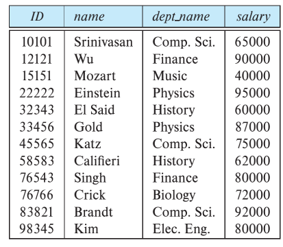

# some terms in database

## table

`relation`: table
`tuple`: row
 
 `relation instance`: refer to a specific instance of a relation, that is, containing a specific set of rows. The instance of `instructor` shown in Figure 1 has 12 tuples, corresponding to 12 instructors.
`relation schema`: always is same to `relation instance`.

## key

`superkey`: A superkey is **a set of one or more attributes** that, taken collectively, allow us to identify uniquely a tuple in the relation.  For example, the combination of ID and name is a superkey for the relation instructor.
`candidate keys`: minimal superkeys. Id is candidate key, `name + dept_name` is also a candidate key. but `id + name` is not a candidate key, because it is not minimal.
`primary key`:  a candidate key that is chosen by the database designer as the principal means of identifying tuples within a relation. For example, in relation `classroom (building, room number, capacity)`, `building + room number` is the primary key
`foreign-key`: is a field (or collection of fields) in one table, that refers to the PRIMARY KEY in another table. The table with the foreign key is called the referencing/child table, and the table with the primary key is called the referenced/parent table.