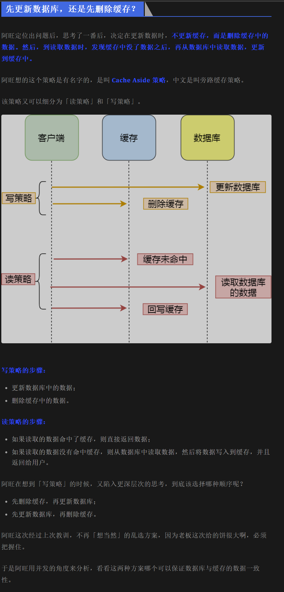

# 数据库和缓存如何保证一致性？

## 总结

一般策略分为: 先操作数据库还是先操作缓存, 然后就是删缓存还是更新缓存

当删除缓存策略下, 当`读写`并发时候,会出现不一致情况.
当更新缓存策略下, 两个线程更新数据时候, 会出现不一致情况.

### 先更新缓存, 再更新数据库

情况: 线程1更新缓存, 然后线程2更新了缓存更新了数据库, 之后线程1更新了数据库, 这样就造成了缓存和数据库不一致.

### 先更新数据库, 再更新缓存

情况: 线程1更新了数据库, 然后线程2更新了缓存, 更新了数据库, 再之后线程1更新了缓存, 这样就造成了缓存和数据库不一致.

所以更新缓存的策略下, 当两个请求并发更新同一条数据的时候，可能会出现缓存和数据库中的数据不一致的现象。

### 先删除缓存, 再修改数据库

情况: 线程1先删缓存, 然后去数据库修改数据的时候, 线程2查缓存没有缓存命中, 去数据库读取到了老的数据, 然后写到了缓存, 然后线程1更新好了数据库的数据, 此时就造成缓存和数据库不一致.
这种情况很有可能发生, 因为修改disk的时间远比修改内存的时间长, 所以线程1没修改完disk的数据, 线程2就已经完成了.

解决办法: 线程1修改完数据库数据后, 再更新一下redis数据. 这样只会造成线程2读取到了老数据仅仅一次, 之后就是新数据了. 这种方法叫**双删**， 因为删除了缓存两次。 第二次删除缓存要用到**延迟双删**， 也就是线程1更新完数据库后， 等待一段时间再删除缓存, 因为要是抢在线程2对redis进行写操作前删除， 那么线程2就会更新老数据到redis中， 删除了个寂寞。

这种方法可以保证**最终一致性**，但是, 遇到强一致性的场景, 因为有读到老数据的可能性, 所以不适用, 解决办法就是线程1给redis加锁, 保证只有一个线程能够操作读取redis， 这会造成性能问题. 也就是CAP理论中的CP和AP只能取一个。

### 先修改数据库, 再删除缓存

情况:
情况1:线程1先修改数据库, 然后在删除缓存的前面, 线程2查缓存拿到了老数据, 这种情况不算缓存不一致情况, 因为这个时间段算是老数据还没被更新, 算是读到脏数据.
情况2: 假设缓存不命中, 线程2读缓存没命中, 去数据库读到老数据, 再之后线程1修改了数据库, 然后删除缓存, 再然后线程2把老数据写到了缓存, 造成缓存和数据库不一致(具体可看下图). 但是这种情况很少发生, 因为缓存的写入通常要远远快于数据库的写入，所以在实际中很难出现线程1已经更新了数据库并且删除了缓存，请求2才更新完缓存的情况。

## 详细

## reference

[xiaolin blog](https://mp.weixin.qq.com/s/sh-pEcDd9l5xFHIEN87sDA)
