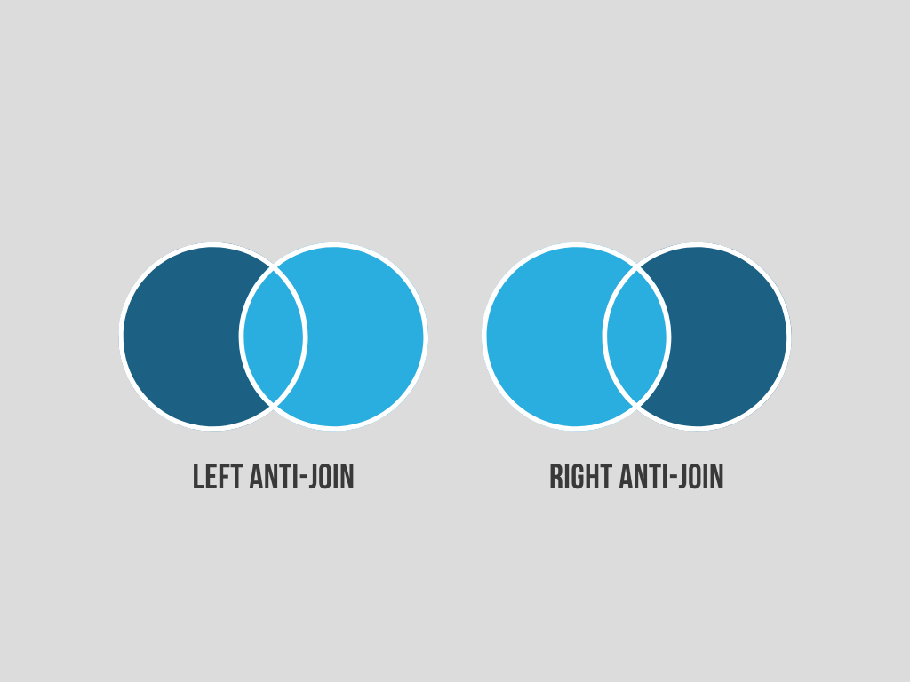
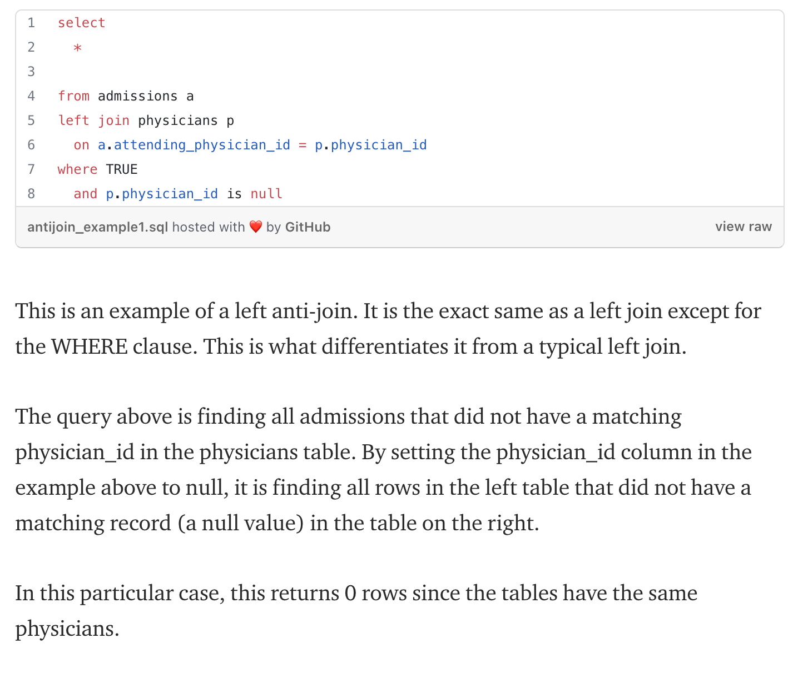
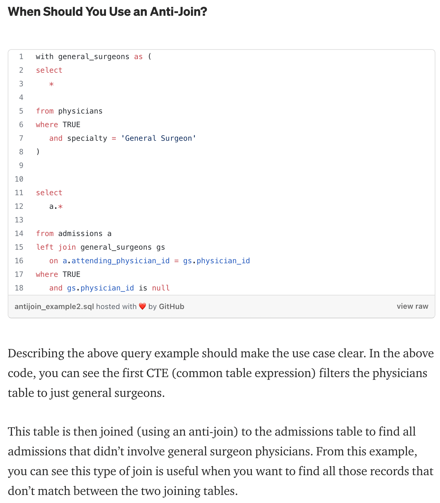
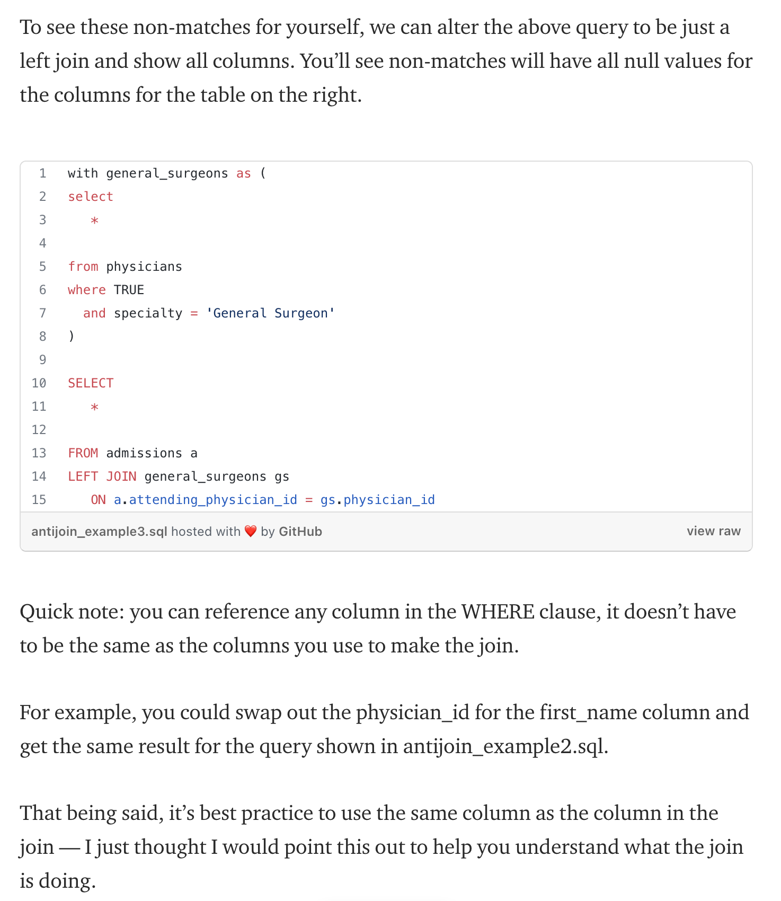

# anti-join

## what is anti-jon

An anti-join is when you would like to keep all of the records in the original table except those records that match the other table.

## example

## reference

[blog](https://towardsdatascience.com/why-is-nobody-talking-about-sql-anti-joins-f970a5f6cb54)
