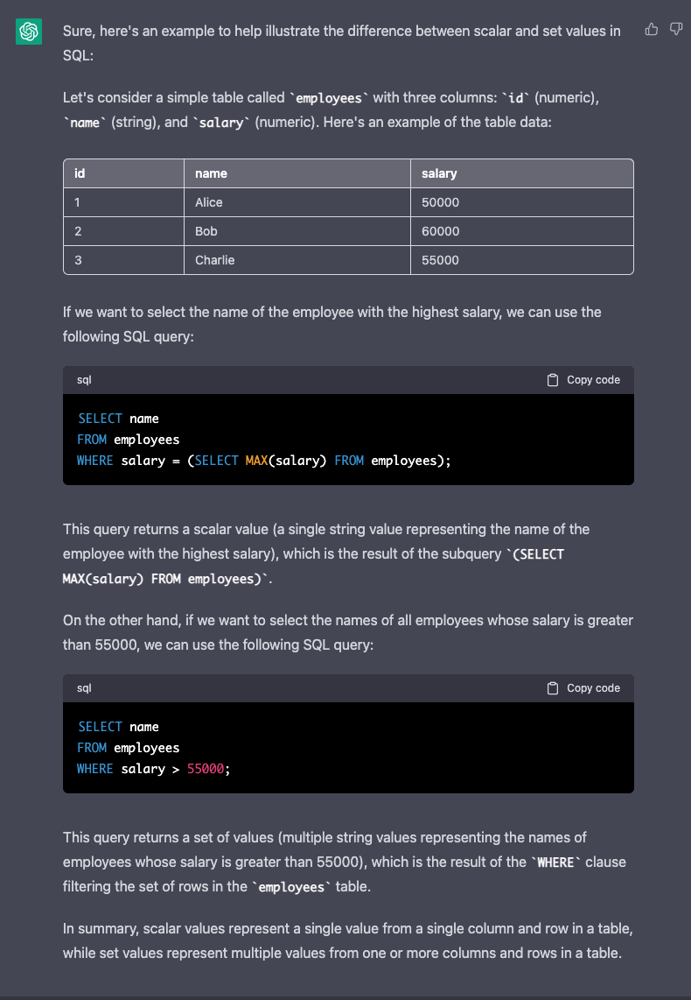

# difference between scalar value and sets

In SQL, a scalar value is a single value that represents a single column and row in a table. It is a non-set value, meaning that it is not a set of rows, but rather a single value that can be used in a variety of operations.

For example, the result of a query that selects a single column and row from a table will be a scalar value. A scalar value can be of different types, including string, numeric, date/time, and boolean.

Scalar values are used extensively in SQL queries, often in combination with other scalar values or sets of rows, to perform various operations like filtering, sorting, aggregating, and joining. They can also be used in various programming languages and data analysis tools to represent single values returned from a database query.

In contrast to scalar values, set values represent a set of rows in a table and can contain multiple values. Set values are returned by set-returning functions (SRFs) in SQL. SRFs are functions that return multiple rows of data as a set, which can then be used in various SQL operations like filtering, sorting, and joining.

