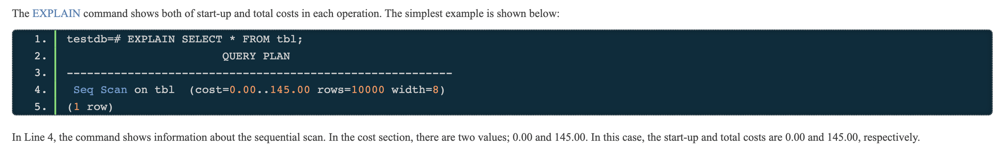

# Cost Estimation in Single-Table Query

PostgreSQL's query optimization is based on cost. Costs are dimensionless values, and these are not absolute performance indicators but are indicators to compare the relative performance of operations.

Costs are estimated by the functions defined in `costsize.c`. All of operations executed by the executor have the corresponding cost functions. For example, the costs of sequential scans and index scans are estimated by `cost_seqscan()` and `cost_index()`, respectively.

In PostgreSQL, there are three kinds of costs: `start-up`, `run` and `total`. The total cost is the sum of start-up and run costs; thus, only the start-up and run costs are independently estimated.

* The `start-up cost` is the cost expended before the first tuple is fetched. For example, the start-up cost of the index scan node is the cost to read index pages to access the first tuple in the target table.
* The `run cost` is the cost to fetch all tuples.
* The total cost is the sum of the costs of both start-up and run costs.

## reference

[content from a book](https://www.interdb.jp/pg/pgsql03.html)
