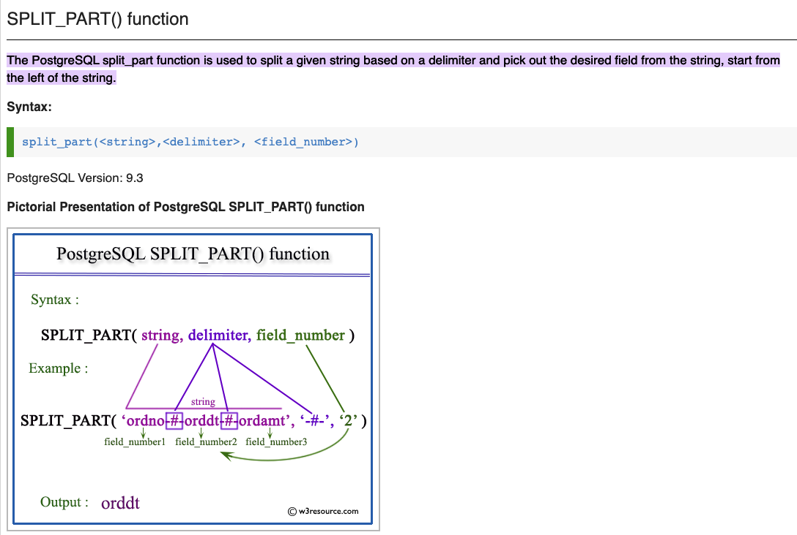

# SPLIT_PART() function

## reference

[link](https://w3resource.com/PostgreSQL/split_part-function.php#:~:text=The%20PostgreSQL%20split_part%20function%20is,the%20left%20of%20the%20string.&text=Example%3A%20PostgreSQL%20SPLIT_PART()%20function,specified%20field%20number%20is%202.)
