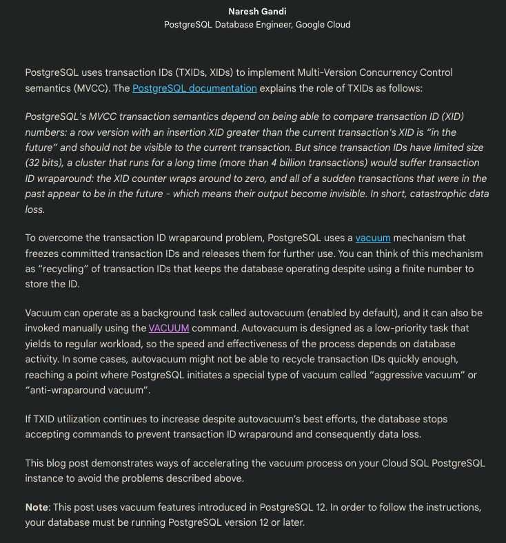
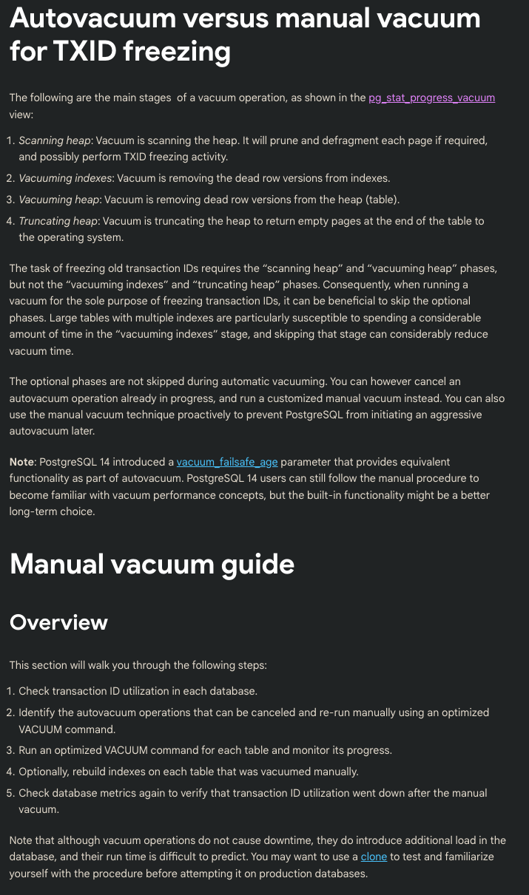
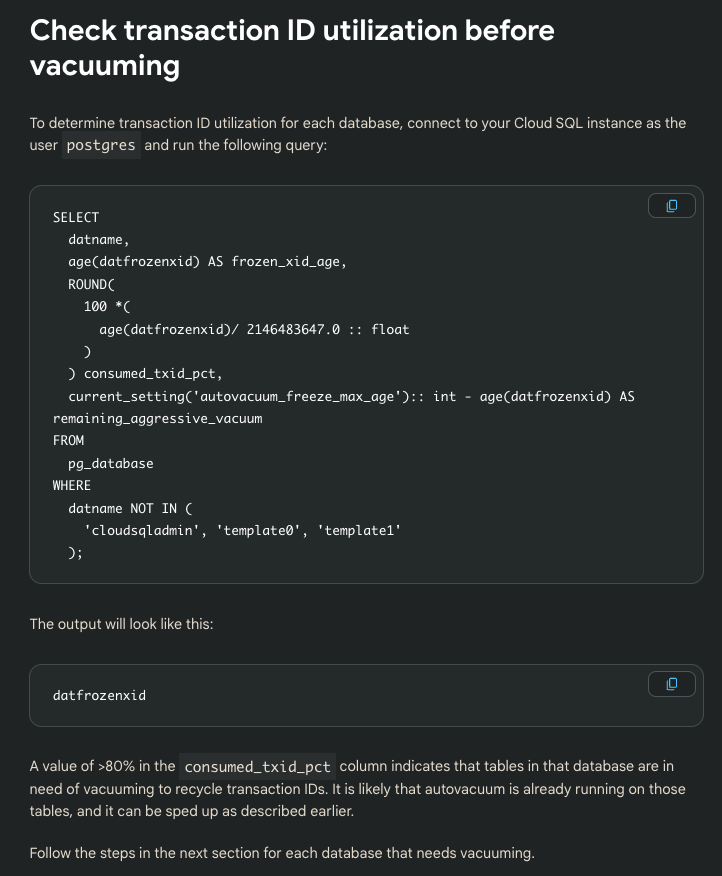
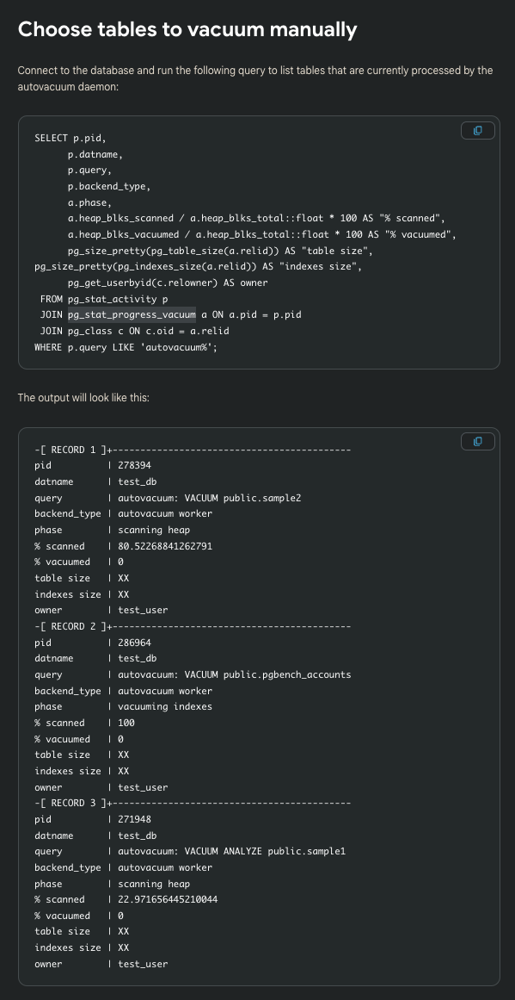
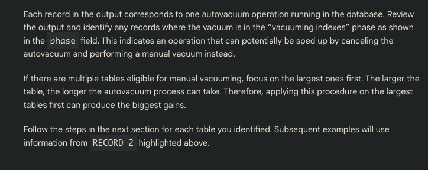
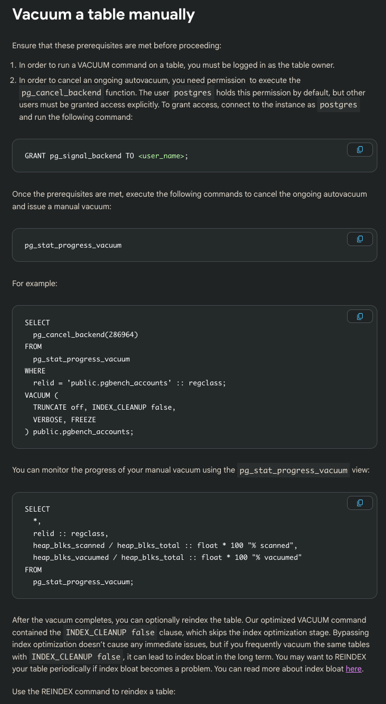
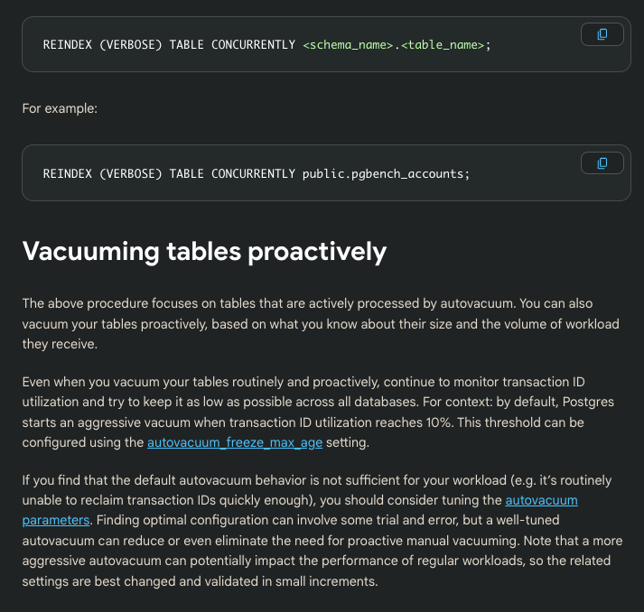
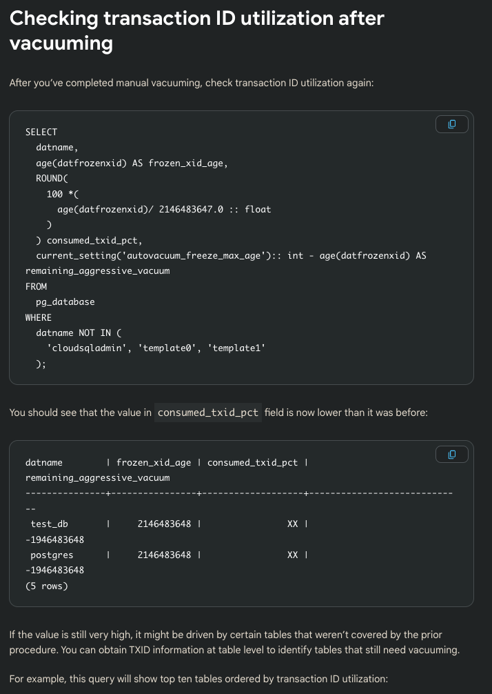
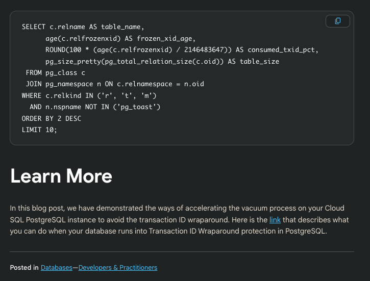

# Using VACUUM to accelerate transaction ID freezing in Cloud SQL for PostgreSQL

## reference

[link](https://cloud.google.com/blog/products/databases/how-to-accelerate-transaction-id-freezing-in-cloud-sql-for-postgresql)