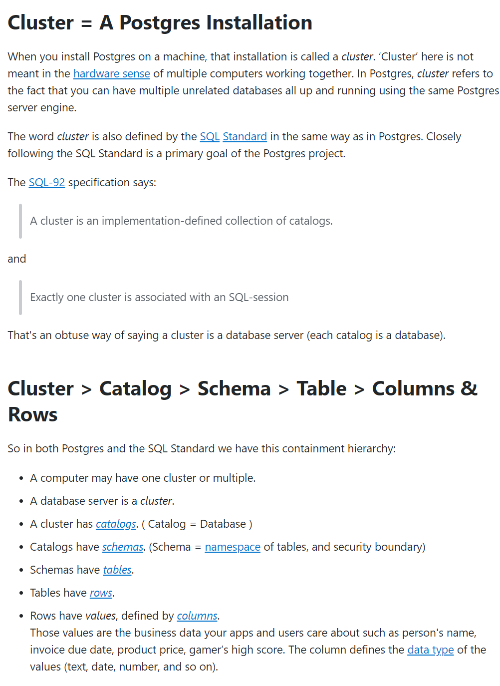
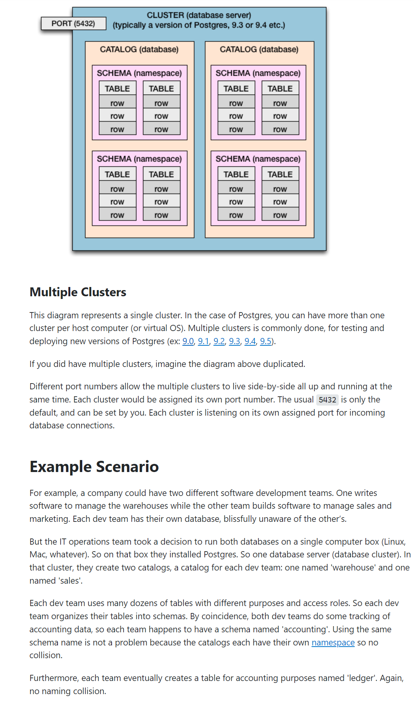
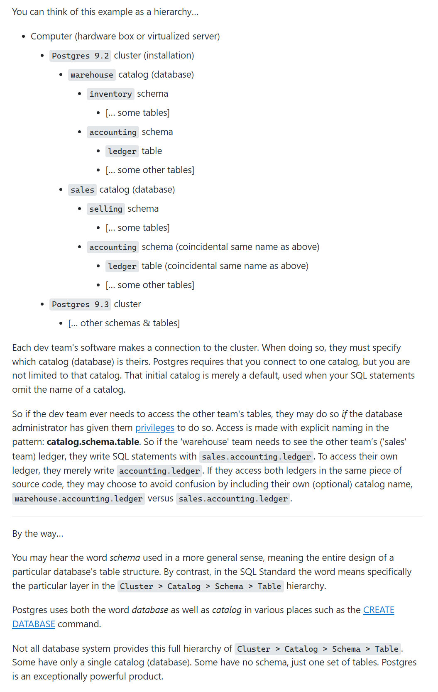
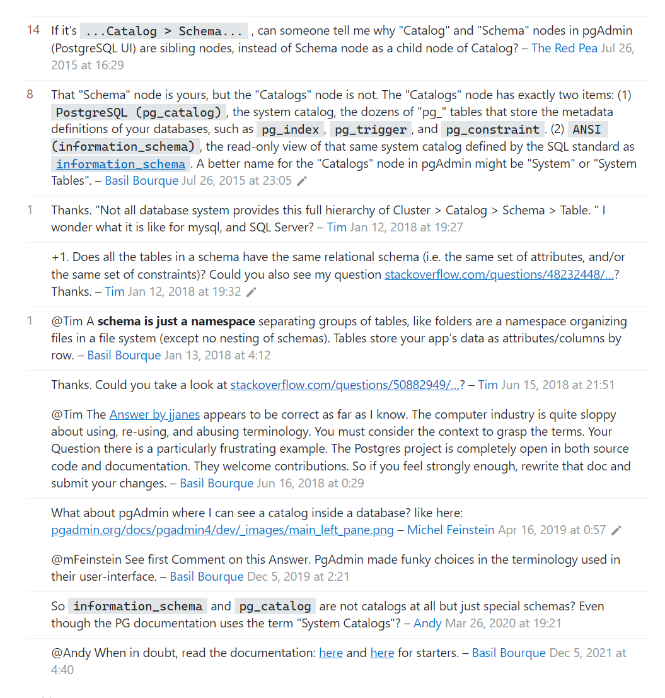

# catalog and schema

## reference

[StackOverflow](https://stackoverflow.com/questions/7022755/whats-the-difference-between-a-catalog-and-a-schema-in-a-relational-database)
[StackOverflow](https://stackoverflow.com/questions/50882949/is-pg-user-a-view-or-a-catalog)
