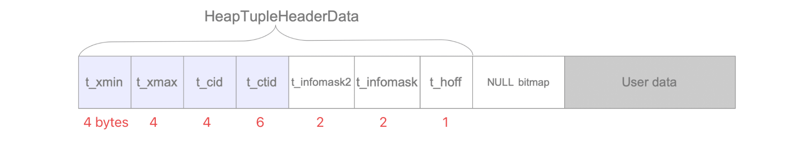

# MAXALIGN

The `HeapTupleHeader` (per row) is 23 bytes long, actual `column data` always starts at a multiple of `MAXALIGN` (typically 8 bytes). That leaves `1` byte of padding that can be utilized by the `NULL bitmap`. In effect NULL storage is absolutely free for tables up to 8 columns.

Basically, NULL values occupy 1 bit in the NULL bitmap. But it's not that simple.

The null bitmap (per row) is only allocated if at least one column in that row holds a NULL value. This can lead to a seemingly paradoxic effect in tables with 9 or more columns: assigning the first NULL value to a column can take up more space on disk than writing a value to it. Conversely, removing the last NULL value from the row also removes the NULL bitmap.

Physically, the initial null bitmap occupies 1 byte between the HeapTupleHeader (23 bytes) and actual column data or the row OID (if you should still be using that) - which always start at a multiple of `MAXALIGN` (typically 8 bytes). This leaves 1 byte of padding that is utilized by the initial null bitmap.

## reference

[stackoverflow](https://stackoverflow.com/questions/12145772/do-nullable-columns-occupy-additional-space-in-postgresql/12147130#12147130)
