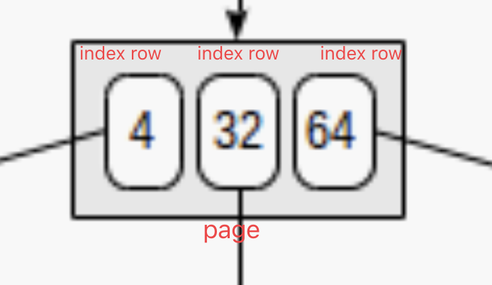
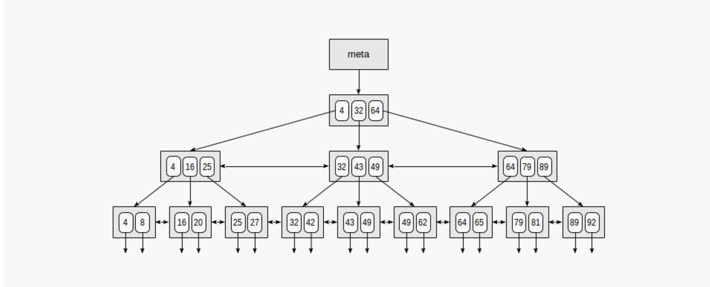
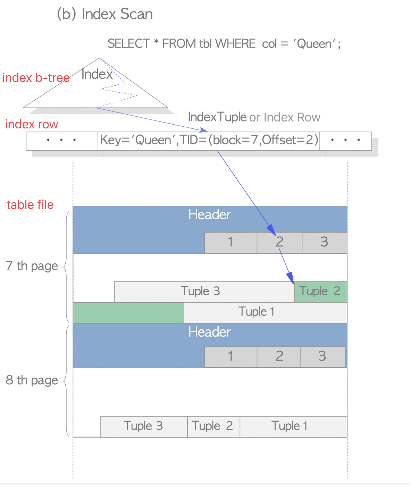
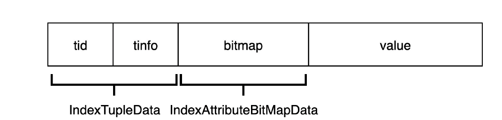

# index b-tree

index and table are separate files.

## index file




as the above picture, index rows are packed into pages. In leaf pages, these rows contain data to be indexed (keys) and references to table rows (TIDs). In internal pages, each row references a child page of the index and contains the minimal value in this page.

* each leaf page is separated to the same number of internal pages.
* each page (usually 8 KB) contains a lot of (hundreds) TIDs. As a result, the depth of B-trees is pretty small, actually up to 4-5 for very large tables.
* Data in the index is sorted in nondecreasing order (both between pages and inside each page), and same-level pages are connected to one another by a bidirectional list. Therefore, we can get an ordered data set just by a list walk one or the other direction without returning to the root each time.
* The very first page of the index is a metapage, which references the index root.
* Internal pages are located below the root, and leaf pages are in the bottommost row. Down arrows represent references from leaf nodes to table rows (TIDs).

## relation between index b-tree file and table file

An **index file** contains **index tuples**, each of which is composed of an index key and a **TID** pointing to the target heap tuple. If the index tuple with the key that you are looking for has been found, PostgreSQL reads the desired heap tuple using the obtained TID value. (The description of the way to find the index tuples in B-tree index is not explained here as it is very common and the space here is limited. See the relevant materials.) For example, in Fig. 1.6(b), TID value of the obtained index tuple is `(block = 7, Offset = 2)`. It means that the target heap tuple is 2nd tuple in the 7th page within the table, so PostgreSQL can read the desired heap tuple without unnecessary scanning in the pages.



## index tuple structure

All index tuples start with IndexTupleData.  If the HasNulls bit is set, this is followed by an IndexAttributeBitMapData.  The index attribute values follow, beginning at a MAXALIGN boundary.



the `IndexTupleData` is as flowing code, the `t_tid` is 48 bits (6 bytes), and the `t_info` is 16 bits (2 bytes). so `IndexTupleData` is 8 bytes

```cpp
typedef struct IndexTupleData
{
	ItemPointerData t_tid;		/* reference TID to heap tuple , 48 bits */

	/* ---------------
	 * t_info is laid out in the following fashion:
	 *
	 * 15th (high) bit: has nulls
	 * 14th bit: has var-width attributes
	 * 13th bit: AM-defined meaning
	 * 12-0 bit: size of tuple
	 * ---------------
	 */

	unsigned short t_info;		/* various info about tuple, 16 bits */

} IndexTupleData;				/* MORE DATA FOLLOWS AT END OF STRUCT */
```

## reference

[the Internals of PostgreSQL](https://www.interdb.jp/pg/pgsql01.html)

[postgres pro](https://postgrespro.com/blog/pgsql/4161516)