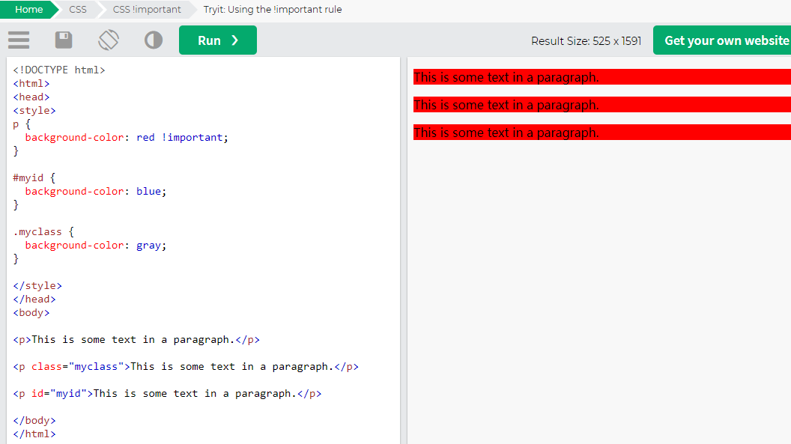

# CSS选择器

父元素: 直接包含子元素的元素叫做父元素

子元素: 直接被父元素包含的元素是子元素

祖先元素
    - 直接或间接包含后代元素的元素叫做祖先元素
    - 一个元素的父元素也是它的祖先元素

后代元素
    - 直接或间接被祖先元素包含的元素叫做后代元素
    - 子元素也是后代元素

兄弟元素
    - 拥有相同父元素的元素是兄弟元素

## 子元素选择器child selector (>)

作用：选中指定父元素的指定子元素
语法：父元素 > 子元素
a descendant selector will select all the descendants of an
element, a child selector only targets the element’s immediate descendants, or children.


```css
#nav > li {
 background: url(folder.png) no-repeat left top;
 padding-left: 20px;
}
```

```HTML
<ul id="nav">
 <li><a href="/home/">Home</a></li>
 <li><a href="/services/">Services</a>
 <ul>
 <li><a href="/services/design/">Design</a></li>
 <li><a href="/services/development/">Development</a></li>
 <li><a href="/services/consultancy/">Consultancy</a></li>
 </ul>
 </li>
 <li><a href="/contact/">Contact Us</a></li>
</ul>
```

## 后代元素选择器Descendant selectors (space)

作用：选中指定元素内的指定后代元素
语法：祖先 后代

代表div下所有的p

```HTML
<div>
    <p>1</p>
    <h1>
        <p>2</p>
    </h1>
</div>
```

```css
div p {
    color: black;
}
```

## 选择下一个兄弟adjacent sibling selector (+)

语法：前一个 + 下一个

```css
p + span{
    color: red;
}

<p>
    我是div中的p元素
    <span>我是p元素中的span</span>
</p>
<span>仅我生效</span>
<span>我是div中的span元素</span>
```

## 选择下边所有的兄弟General Sibling Selector (~)

```css
p ~ span{
    color: red;
}

<p>
    我是div中的p元素
    <span>不生效</span>
</p>
<span>生效</span>
<span>生效</span>
```

## The Cascade

### important




