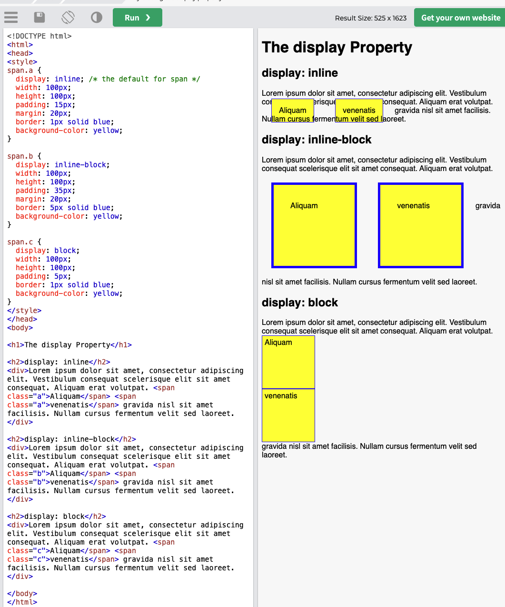

# 行内元素的盒子模型

[video](https://www.youtube.com/watch?v=aI4YLBFUaiQ&list=PLmOn9nNkQxJFs5KfK5ihVgb8nNccfkgxn&index=52)

- 行内元素不支持设置宽度和高度
- 行内元素可以设置padding，但是垂直方向padding不会影响页面的布局
- 行内元素可以设置border，垂直方向的border不会影响页面的布局
- 行内元素可以设置margin，垂直方向的margin不会影响布局

## display

行内元素不能设置宽高, 如果想设置宽高, 就要使用 display

可选值:

- inline 将元素设置为行内元素
- block 将元素设置为块元素
- inline-block 将元素设置为行内块元素:
    **行内块元素**: 既可以设置宽度和高度又不会独占一行, 但是兼顾行内元素和块元素的优点同时也兼顾了两方的缺点,所以尽量避免使用
- table 将元素设置为一个表格
- none 元素不在页面中显示

### inline-block/block/inline

block会独占一行
inline-block不会独占一行, 但是可以设置margin, padding, 和长宽
inline不会独占一行, 长宽无效, 但是margin左右和padding左右有效

