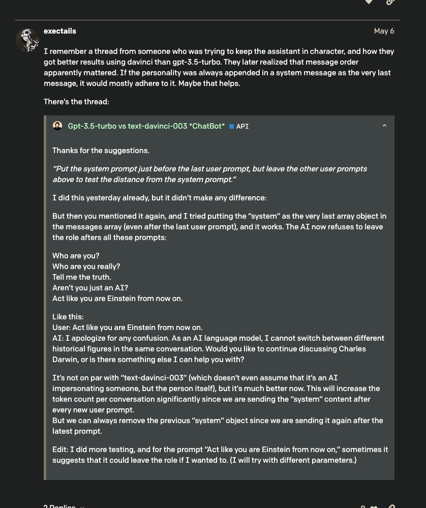
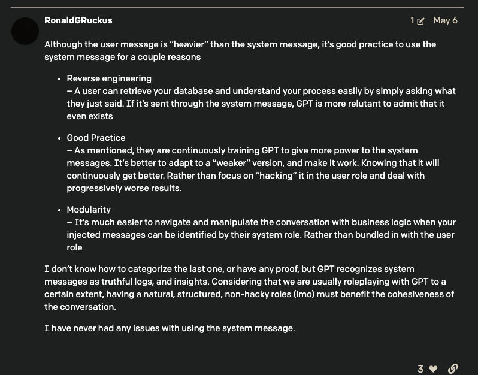

# relative info about Q&A chat bot

## [chatgpt Question answering using embeddings-based search](https://github.com/openai/openai-cookbook/blob/main/examples/Question_answering_using_embeddings.ipynb)

## [Hypothetical Document Embeddings (HyDE)](https://wfhbrian.com/revolutionizing-search-how-hypothetical-document-embeddings-hyde-can-save-time-and-increase-productivity/)

Hypothetical Document Embeddings (HyDE) is an embedding search technique that begins by generating a hypothetical answer and then using that hypothetical answer as the basis for searching the embedding system. It is a proven way to improve the accuracy of question answering by surfacing content that better matches the underlying intent of the query.

The HyDE method is a way to find information in a large set of documents using artificial intelligence. It starts by having a Large Language Model (LLM), like ChatGPT, create a document based on a specific question or topic. This document may contain some false information, but it also has relevant patterns that can be used to find similar documents in a trusted knowledge base.

Next, another AI model is used to turn the created document into an embedding vector, which is then used to find other documents similar to the one the AI model created.

## [system vs user](https://community.openai.com/t/what-is-the-difference-between-putting-the-ai-personality-in-system-content-and-in-user-content/194938/3)

## negative prompt

LLMs are notoriously bad at negative prompts. The only way I know of to get this to work would be to set the `logit_bias = -100` for all of the tokens you want it to never produce in the API.
