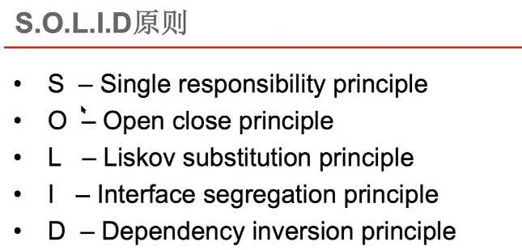
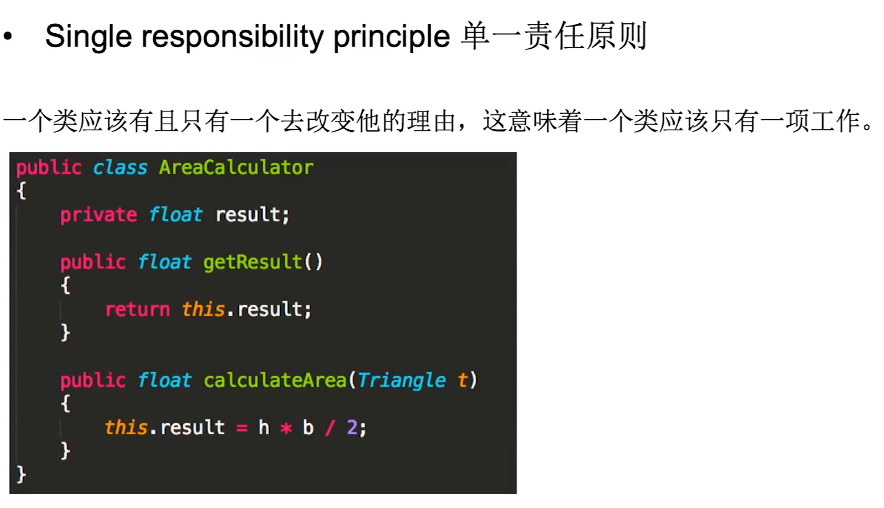
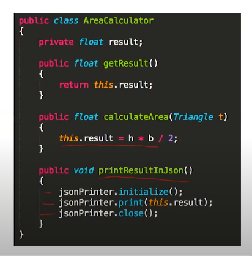
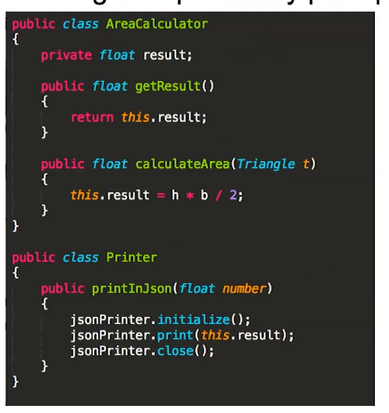
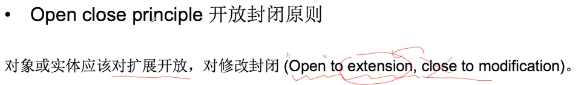
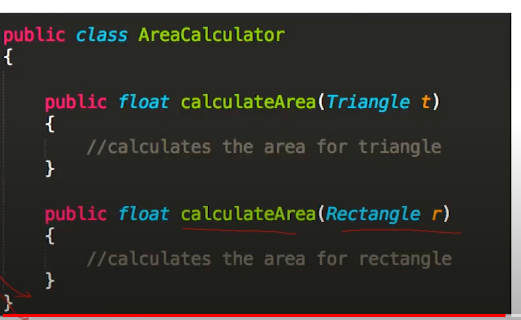
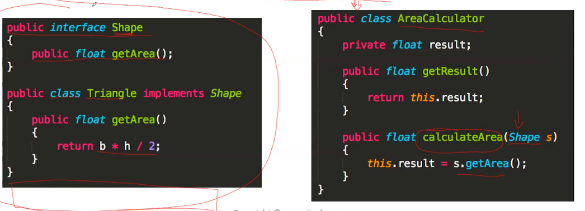

# ood设计原则

## 单一责任原则

一个类用于计算三角形面积. 然后领导要求增加一个功能,把结果用json打印出来:

这时候就违反了单一责任原则

以后需求会不断更新,不仅要求打印json结果,也可能各种类型的结果,这时候类会逐渐非常的臃肿.

优化后:

## 开放封闭原则

要求容易拓展,容易被修改

上述例子就不好, 因为如果以后每想计算一种形状的面积,就要在下面增加一个函数进行计算

优化:

利用抽象

