# 实战 --- 设计电梯系统

## 5C 结题法

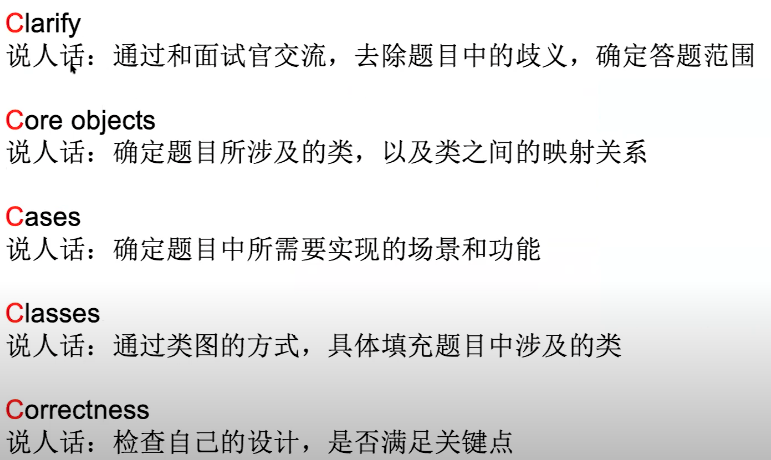

## 1.clarify 审题

首先审题，解除疑惑

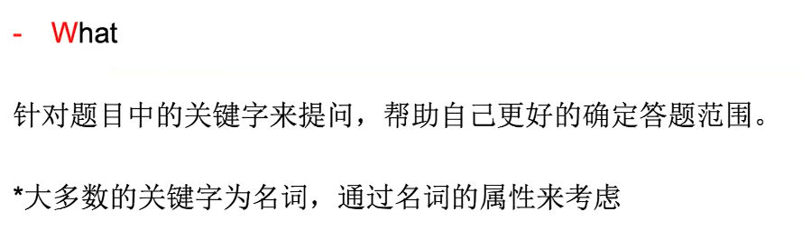

### 关键字1

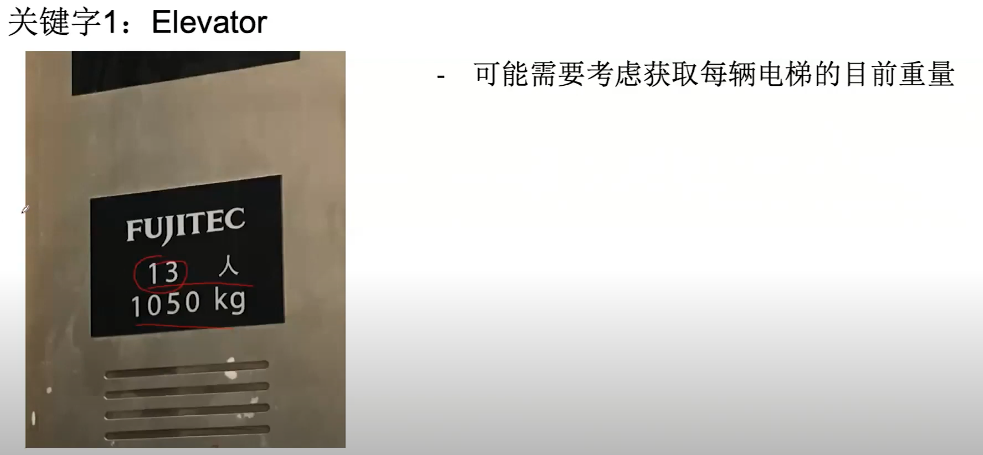

提问：这个电梯目前称重是如何得到的？ 从sensor还是什么？

### 关键字2

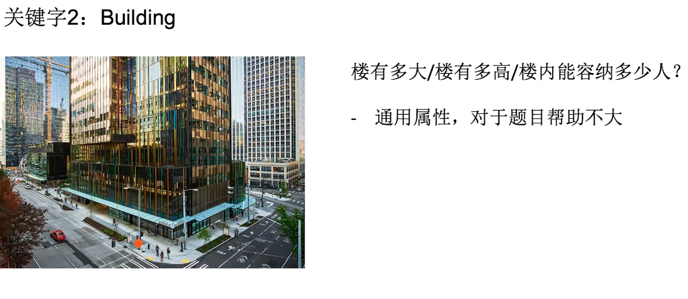

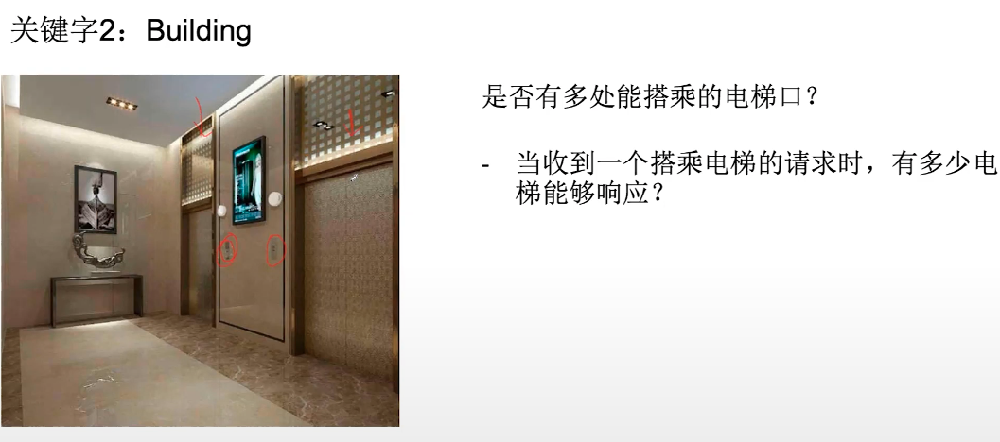

假设每一层仅一处能搭乘电梯，所有电梯均可响应

### How

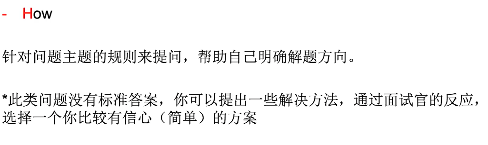

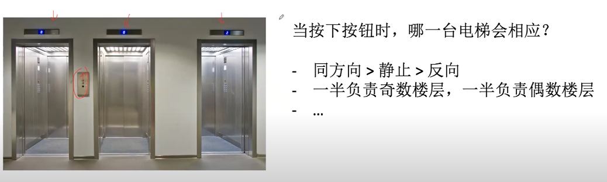

corner case:

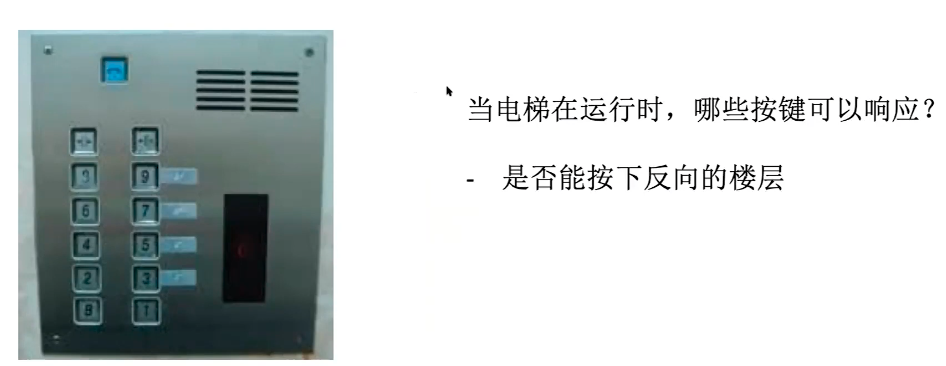

## 2. Core Object

为了完成这个题，需要哪些类？

### 如何定义Core Object

1. 以一个Object 作为基础, 线性思考
2. 确定object 之间的映射关系

### 以一个Object 作为基础, 线性思考

最基本的类，一定会有的就是 ElevatorSystem 类，现象思考： 该类的输入是什么，输出是什么。 这些定义出来，整个大致框架就有了：
按下按钮，电梯响应，所以要有request 输入请求 -> 一个电梯去响应，所以输出为Elevator
这个Elevator 包含什么东西吗？ 应该含有按钮

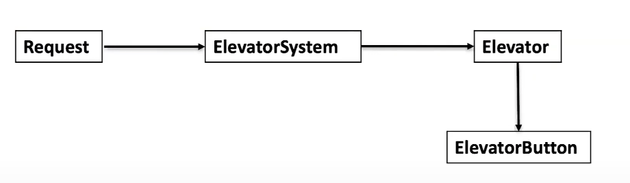

### 映射关系

这些类之间是什么映射关系？ 一对多，多对一？ 一个电梯系统应该有很多个电梯，一个电梯也会有很多的按钮

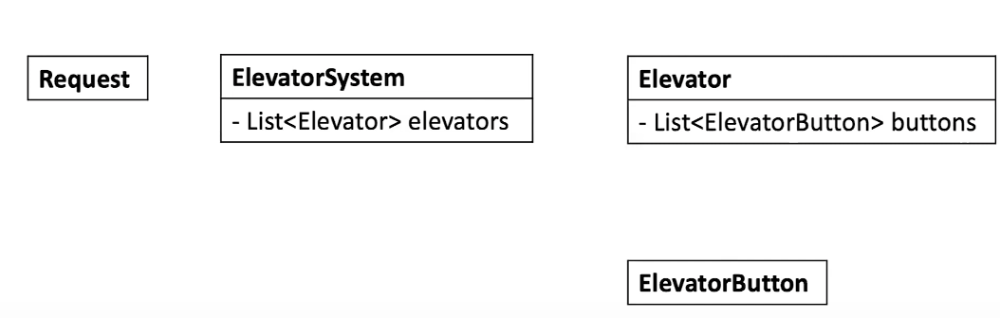

永远不要用 package level， 一般都是 public 和 private 或 protected

## 3. Cases

### 什么是 Use Cases?

在你设计的系统中，需要支持哪些功能

### 为什么要写 use cases

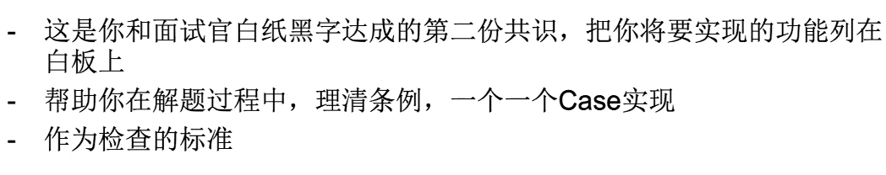

### 怎么写 use cases

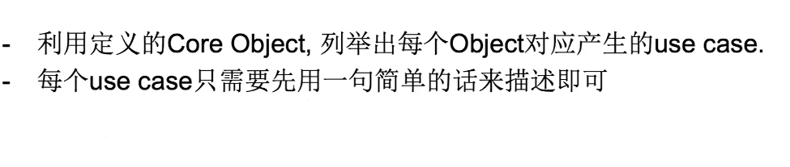

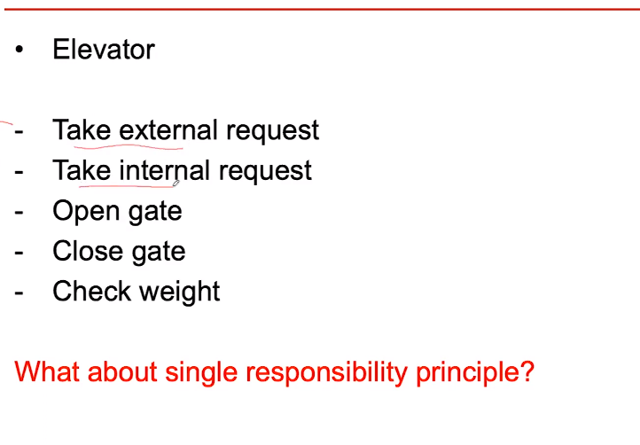

## 4. class

画UML类图

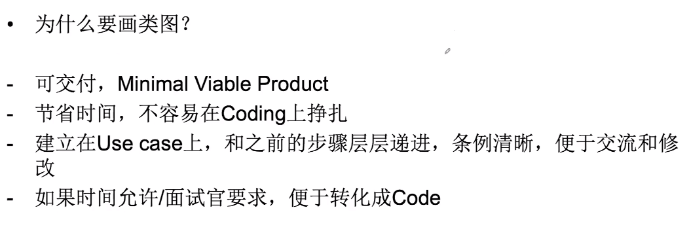

具体实例 视频 52:00 开始

## reference

[video](https://www.youtube.com/watch?v=CsWFuFdlBVU&list=PLNuQtXS21vLWeWbmydW1nbCgT7PkgggHA&index=4)
