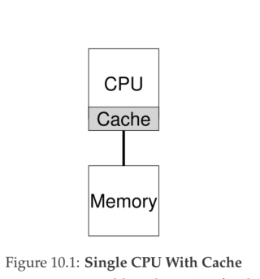

# cpu core are packed onto a single chip

there are many difficulties that arise with the arrival of more than a single CPU: a typical application (i.e., some C program you wrote) only uses a single CPU; adding more CPUs does not make that single application run faster

To remedy this problem, you’ll have to rewrite your application to run in **parallel**, perhaps using **threads** (as discussed in great detail in the second piece of this book). Multithreaded applications can spread work across multiple CPUs and thus run faster when given more CPU resources.

## how to schedule jobs on multiple cpus

To understand the new issues surrounding multiprocessor scheduling, we have to understand  difference between single-CPU hardware and multi-CPU hardware. This difference centers around the use of hardware caches

In a system with a single CPU, there are a hierarchy of hardware caches that in general help the processor run programs faster. Caches are small, fast memories that (in general) hold copies of popular data that is found in the main memory of the system. Main memory, in contrast, holds all of the data, but access to this larger memory is slower. By keeping frequently accessed data in a cache, the system can make the large, slow memory appear to be a fast one.

As it turns out, caching with multiple CPUs is much more complicated. Imagine, for example, that a program running on CPU 1 reads a data item (with value D) at address A; because the data is not in the cache on CPU 1, the system fetches it from main memory, and gets the value D. The program then modifies the value at address A, just updating its cache with the new value D ′ ; writing the data through all the way to main memory is slow, so the system will (usually) do that later. Then assume the OS decides to stop running the program and move it to CPU 2. The program then re-reads the value at address A; there is no such data CPU 2’s cache, and thus the system fetches the value from main memory,
and gets the old value D instead of the correct value D ′ . Oops!

The basic solution is provided by the hardware: by monitoring memory accesses, hardware can ensure that basically the “right thing” happens and that the view of a single shared memory is preserved. One way to do this on a bus-based system (as described above) is to use an old technique known as bus snooping [G83]; In modern operating system, an solution, of course, is to make such routines correct via **locking**. Unfortunately, as we will see, such an approach is not without problems, in particular with regards to performance. Specifically, as the number of CPUs grows, access to a synchronized shared data structure becomes quite slow. How to deal with this problem will show in the future. this chapter is main for sheduling

## Cache Affinity

One final issue arises in building a multiprocessor cache scheduler, known as cache affinity [TTG95]. This notion is simple: a process, when run on a particular CPU, builds up a fair bit of state in the caches (and TLBs) of the CPU. The next time the process runs, it is often advantageous to run it on the same CPU, as it will run faster if some of its state is already present in the caches on that CPU. If, instead, one runs a process on a different CPU each time, the performance of the process will be worse, as it will have to reload the state each time it runs (note it will run correctly on a different CPU thanks to the cache coherence protocols of the hardware). Thus, a multiprocessor scheduler should consider cache affinity when making its scheduling decisions, perhaps preferring to keep a process on the same CPU if at all possible.

## Single-Queue Scheduling(APUE P107)

## Multi-Queue Scheduling(APUE P109)