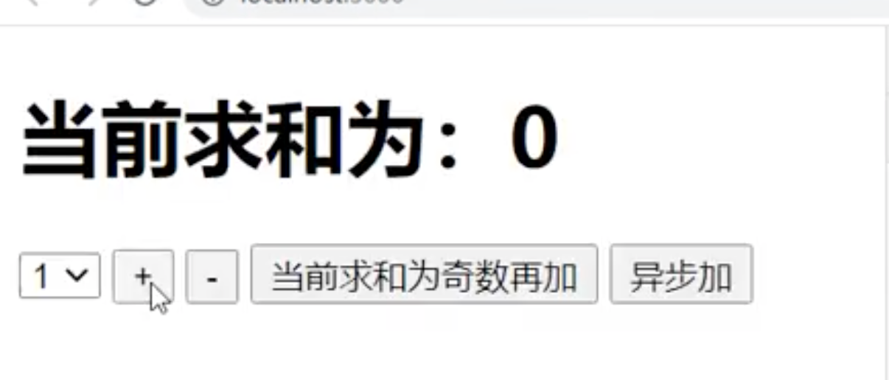
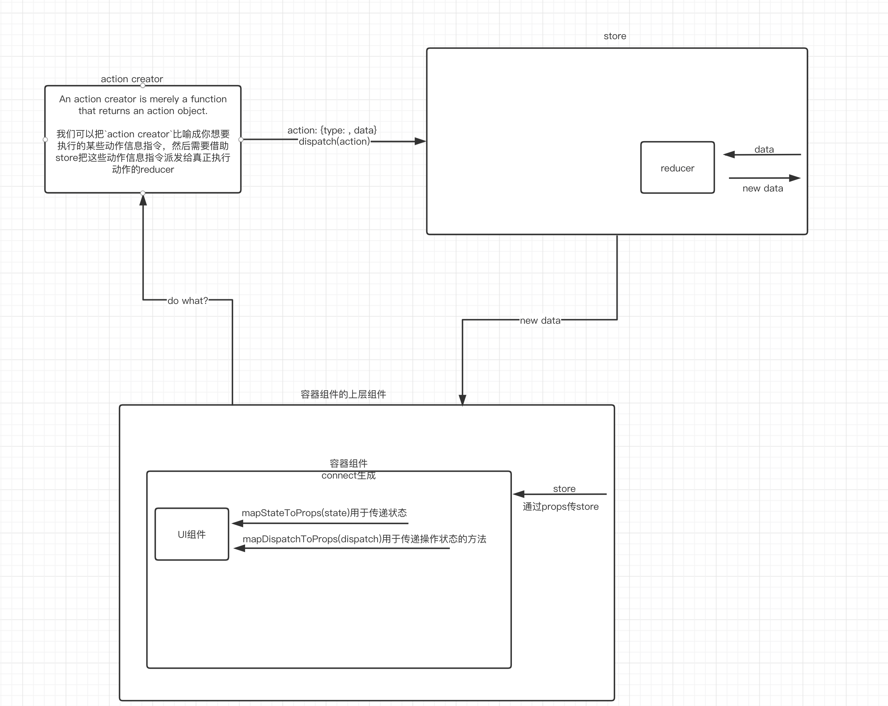
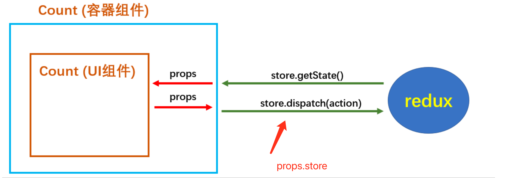

# redux

[toc]

## 为什么用redux

## 原理图


## redux具体实现代码实例

### action creators

主要还是为了将数据封装为store能看懂的类型

```javascript
/*
该模块是用于定义action对象中type类型的常量值，目的只有一个：便于管理的同时防止程序员单词写错
*/
export const INCREMENT = 'increment'
export const DECREMENT = 'decrement'


/*
该文件专门为Count组件生成action对象
*/
import { INCREMENT,DECREMENT } from './constant'

export const createIncrementAction = data => ({type:INCREMENT,data})
export const createDecrementAction = data => ({type:DECREMENT,data})

```

### react component

count component:

```javascript

import React, { Component } from 'react'
//引入store，用于获取redux中保存状态
import store from '../../redux/store'
//引入actionCreator，专门用于创建action对象
import {createIncrementAction,createDecrementAction} from '../../redux/count_action'

export default class Count extends Component {

    state = {carName:'奔驰c63'}

    /* componentDidMount(){
        //检测redux中状态的变化，只要变化，就调用render
        store.subscribe(()=>{
            this.setState({})
        })
    } */

    //加法
    increment = ()=>{
        const {value} = this.selectNumber
        // 通过component把value传给store
        store.dispatch(createIncrementAction(value*1))
    }
    //减法
    decrement = ()=>{
        const {value} = this.selectNumber
        store.dispatch(createDecrementAction(value*1))
    }
    //奇数再加
    incrementIfOdd = ()=>{
        const {value} = this.selectNumber
        const count = store.getState()
        if(count % 2 !== 0){
            store.dispatch(createIncrementAction(value*1))
        }
    }
    //异步加
    incrementAsync = ()=>{
        const {value} = this.selectNumber
        setTimeout(()=>{
            store.dispatch(createIncrementAction(value*1))
        },500)
    }

    render() {
        return (
            <div>
                <h1>当前求和为：{store.getState()}</h1>
                <select ref={c => this.selectNumber = c}>
                    <option value="1">1</option>
                    <option value="2">2</option>
                    <option value="3">3</option>
                </select>&nbsp;
                <button onClick={this.increment}>+</button>&nbsp;
                <button onClick={this.decrement}>-</button>&nbsp;
                <button onClick={this.incrementIfOdd}>当前求和为奇数再加</button>&nbsp;
                <button onClick={this.incrementAsync}>异步加</button>&nbsp;
            </div>
        )
    }
}

```



### store: 派发的人

把actio creator封装的数据派发给具体执行动作的. store是框架实现, 开发者自己用现成的

```javascript
/*
该文件专门用于暴露一个store对象，整个应用只有一个store对象
*/

//引入createStore，专门用于创建redux中最为核心的store对象
import {createStore} from 'redux'
//引入为Count组件服务的reducer
import countReducer from './count_reducer'
//暴露store
export default createStore(countReducer)
```

### reducer-具体执行者

```javascript
/*
1.该文件是用于创建一个为Count组件服务的reducer，reducer的本质就是一个函数
2.reducer函数会接到两个参数，分别为：之前的状态(preState)，动作对象(action)
*/
import {INCREMENT,DECREMENT} from './constant'

const initState = 0 //初始化状态
export default function countReducer(preState=initState,action){
    // console.log(preState );
    //从action对象中获取：type、data
    const {type,data} = action
    //根据type决定如何加工数据
    switch (type) {
        case INCREMENT: //如果是加
            return preState + data
        case DECREMENT: //若果是减
            return preState - data
        default:
            return preState
    }
}
```

## react-redux

与上面不同的是，react-redux是react官方出品的库

### 模型图




UI组件只做界面的呈现，只绑定事件的监听等。和redux打交道的要给容器组件做。

### 代码实现

#### 先实现一个count UI组件

```javascript
import React, { Component } from 'react'

export default class Count extends Component {

    state = {carName:'奔驰c63'}

    //加法
    increment = ()=>{
        const {value} = this.selectNumber
        // 父亲容器组件定义的 mapDispatchToProps 传递的函数。通过props传递过来
        this.props.jia(value*1) // 不做具体的函数实现，交给props.jia, 下同
    }
    //减法
    decrement = ()=>{
        const {value} = this.selectNumber
        this.props.jian(value*1)
    }
    //奇数再加
    incrementIfOdd = ()=>{
        const {value} = this.selectNumber
        // 父亲容器组件定义的 mapStateToProps 传递的函数。通过props传递过来
        if(this.props.count % 2 !== 0){
            this.props.jia(value*1)
        }
    }
    //异步加
    incrementAsync = ()=>{
        const {value} = this.selectNumber
        this.props.jiaAsync(value*1,500)
    }

    render() {
        //console.log('UI组件接收到的props是',this.props);
        return (
            <div>
                <h1>当前求和为：{this.props.count}</h1>
                <select ref={c => this.selectNumber = c}>
                    <option value="1">1</option>
                    <option value="2">2</option>
                    <option value="3">3</option>
                </select>&nbsp;
                <button onClick={this.increment}>+</button>&nbsp;
                <button onClick={this.decrement}>-</button>&nbsp;
                <button onClick={this.incrementIfOdd}>当前求和为奇数再加</button>&nbsp;
                <button onClick={this.incrementAsync}>异步加</button>&nbsp;
            </div>
        )
    }
}
```

#### 容器组件container

然后实现一个包裹他的容器组件。容器组件不能自己写.

容器组件主要作用为 连接UI组件和redux。图片中红色绿色箭头部分。所以容器组件要做到和redux交互（绿色箭头），和子组件交互（红色箭头）

容器组件要给UI组件传递（1）redux中所保存的状态 （2）用于操作状态的方法

一般的父子组件都是通过props传递东西，但是容器组件不是一个常规的react组件，需要通过connect的第一个括号传递

`connect(a, b)(UIcomponent)`接收的参数`a,b`是两个函数, `a`函数的返回值作为状态传递给UI组件，即上述的（1）。所以返回值必须是一个object。
`b`函数用于操作状态的方法，即上述(2), 返回也是一个对象

```javascript
//引入Count的UI组件，即子组件
import CountUI from '../../components/Count'
//引入action
import {
    createIncrementAction,
    createDecrementAction,
    createIncrementAsyncAction
} from '../../redux/count_action'

//引入connect用于连接UI组件与redux
import {connect} from 'react-redux'

/*
1.mapStateToProps函数返回的是一个对象；
2.返回的对象中的key就作为传递给UI组件props的key,value就作为传递给UI组件props的value
3.mapStateToProps用于传递状态
*/
function mapStateToProps(state){ // store已经把状态传过来，只需要接收下。 图中绿色左指向的箭头
    return { count:state } // 图中红色左指向的箭头
}

/*
1.mapDispatchToProps函数返回的是一个对象；
2.返回的对象中的key就作为传递给UI组件props的key,value就作为传递给UI组件props的value
3.mapDispatchToProps用于传递操作状态的方法
*/
function mapDispatchToProps(dispatch){
    return {
        // 通知redux执行加法
        // 下面是常规方法
        // jia: {
        //     store.dispatch({type: 'increment', data: number})
        // },
        // 但是可以用react-redux方法
        // 通过action creator定义的函数action，dispathch
        jia:number => dispatch(createIncrementAction(number)),
        jian:number => dispatch(createDecrementAction(number)),
        jiaAsync:(number,time) => dispatch(createIncrementAsyncAction(number,time)),
    }
}

//使用connect()()创建并暴露一个Count的容器组件
export default connect(mapStateToProps,mapDispatchToProps)(CountUI)
```

#### 容器组件的上层组件

store必须通过props方式传递给容器组件，才能建立组件component和redux之间连接

```javascript
import React, { Component } from 'react'
import Count from './containers/Count'
import store from './redux/store' // store不用自己创建，整个redux只维护一个store

export default class App extends Component {
    render() {
        return (
            <div>
                {/* 给容器组件传递store */}
                <Count store={store} />
            </div>
        )
    }
}
```



#### action creator

An action creator is merely a function that returns an action object.

Redux includes a utility function called `bindActionCreators` for binding one or more action creators to the `store's dispatch()` function.

`action creator` just like some action information which will be `reported` by dispatch.

我们可以把`action creator`比喻成你想要执行的某些动作信息指令，然后需要借助store把这些动作信息指令派发给真正执行动作的reducer

If you're really paying attention, you'll also remember that we said actions, ideally, should `report` things that happened, not `make` things happen. If the dispatch is the `report`, then what actually `sends` the report!?

```javascript
/*
该文件专门为Count组件生成action对象
*/
import {INCREMENT,DECREMENT} from './constant'

//同步action，就是指action的值为Object类型的一般对象
export const createIncrementAction = data => ({ type:INCREMENT,data })
export const createDecrementAction = data => ({ type:DECREMENT,data })

//异步action，就是指action的值为函数,异步action中一般都会调用同步action，异步action不是必须要用的。
export const createIncrementAsyncAction = (data,time) => {
    // 现在store内部执行settimeout函数，time时间到了之后才会执行 dispatch(createIncrementAction(data))
    return dispatch => {
        setTimeout(() => {
            dispatch(createIncrementAction(data))
        }, time)
    }
}
```

actually, we do `sends` in container component:

```javascript
jia: number => dispatch(createIncrementAction(number)),
```

#### reducer

具体执行动作

```javascript
/*
1.该文件是用于创建一个为Count组件服务的reducer，reducer的本质就是一个函数
2.reducer函数会接到两个参数，分别为：之前的状态(preState)，动作对象(action)
*/
import {INCREMENT,DECREMENT} from './constant'

const initState = 0 //初始化状态
export default function countReducer(preState=initState,action){
    // console.log(preState);
    //从action对象中获取：type、data
    const {type,data} = action // 拿到action creator想要执行的type和data
    //根据type决定如何加工数据
    switch (type) {
        case INCREMENT: //如果是加
            return preState + data
        case DECREMENT: //若果是减
            return preState - data
        default:
            return preState
    }
}
```

#### store

串联 action creator 和 reducer

如果没有异步action

```javascript
// 如果没有异步action

/*
该文件专门用于暴露一个store对象，整个应用只有一个store对象
*/

//引入createStore，专门用于创建redux中最为核心的store对象
import {createStore} from 'redux'
//引入为Count组件服务的reducer
import countReducer from './count_reducer'
//暴露store
export default createStore(countReducer) // 把reducer放进store
```

如果有异步action

```javascript
/*
    该文件专门用于暴露一个store对象，整个应用只有一个store对象
*/

//引入createStore，专门用于创建redux中最为核心的store对象
import {createStore,applyMiddleware} from 'redux'
//引入为Count组件服务的reducer
import countReducer from './count_reducer'
//引入redux-thunk，用于支持异步action
import thunk from 'redux-thunk'
//暴露store
export default createStore(countReducer,applyMiddleware(thunk))
```

## 其他

### react-redux自动检测redux状态变化并渲染

如果不自动检测

```javascript
import React from 'react'
import ReactDOM from 'react-dom'
import App from './App'
import store from './redux/store'

ReactDOM.render(<App/>,document.getElementById('root'))

//监测redux中状态的改变，如redux的状态发生了改变，那么重新渲染App组件
store.subscribe(()=>{
    ReactDOM.render(<App/>,document.getElementById('root'))
})
```

可以自动检测

```javascript
import React from 'react'
import ReactDOM from 'react-dom'
import App from './App'

ReactDOM.render(<App/>,document.getElementById('root'))
```

### provider

如果我们每次都在`容器组件的上层组件`自己手动引入store， 会是一件很麻烦的事:

```javascript
import React, { Component } from 'react'
import Count from './containers/Count'
import store from './redux/store' // store不用自己创建，整个redux只维护一个store

export default class App extends Component {
    render() {
        return (
            <div>
                {/* 给容器组件传递store */}
                <Count1 store={store} />
                <Count2 store={store} />
                <Count3 store={store} />
                <Count4 store={store} />
                <Count5 store={store} />
            </div>
        )
    }
}
```

我们可以在APP组件的上层组件用provider组件统一传入store

```javascript
import React from 'react'
import ReactDOM from 'react-dom'
import App from './App'
import store from './redux/store'
import {Provider} from 'react-redux'

ReactDOM.render(
    <Provider store={store}>
        <App/>
    </Provider>,
    document.getElementById('root')
)
```

### 工程上文件优化

1. 容器组件和UI组件可以写在一个文件内
