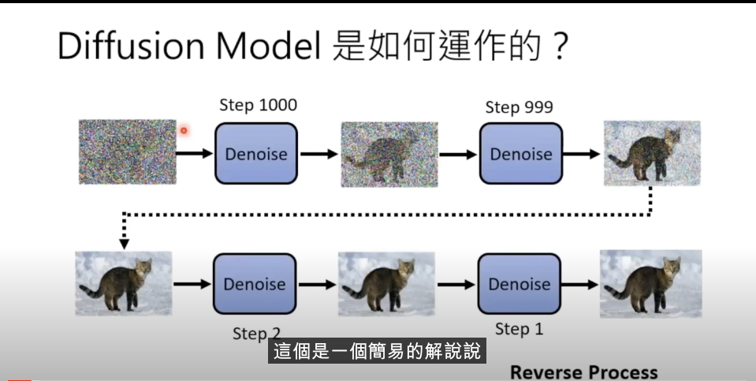
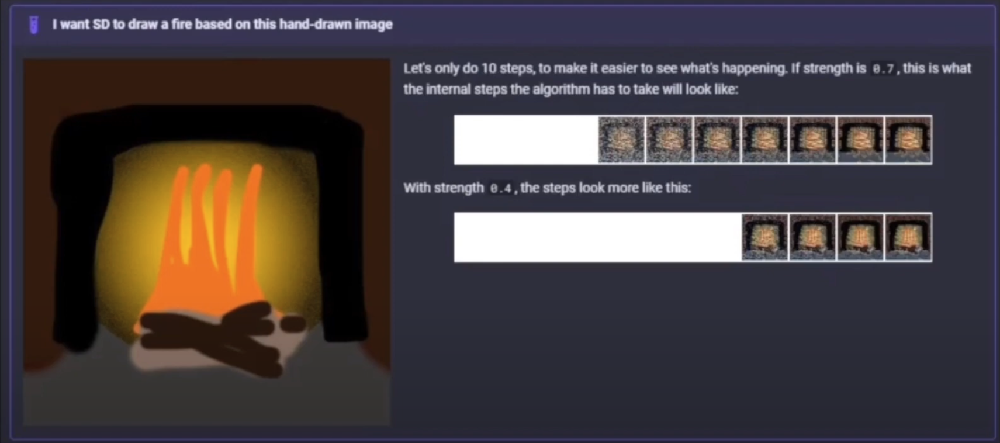
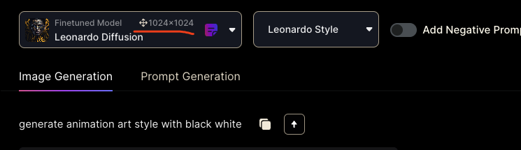
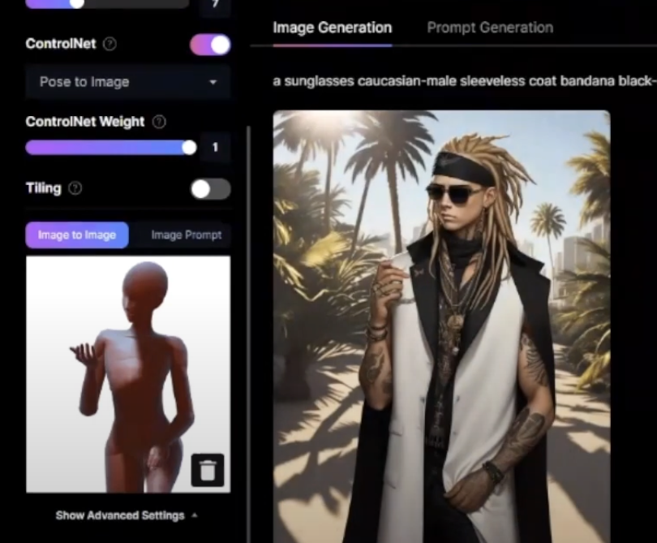
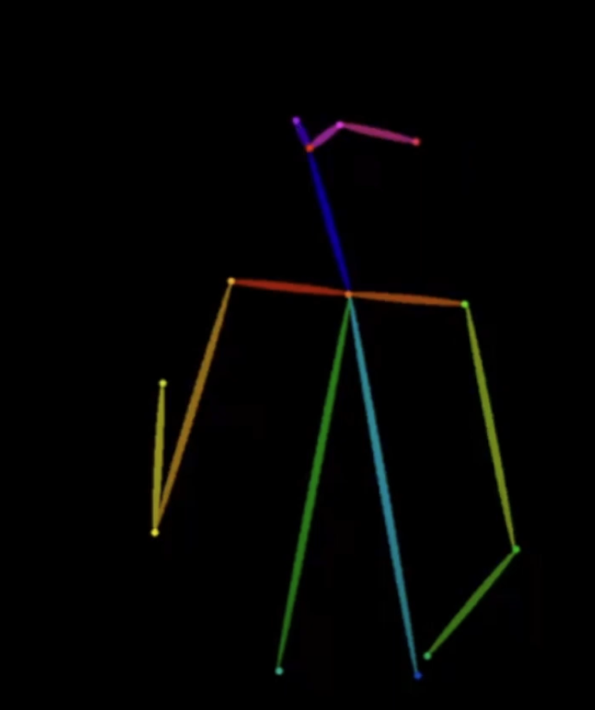
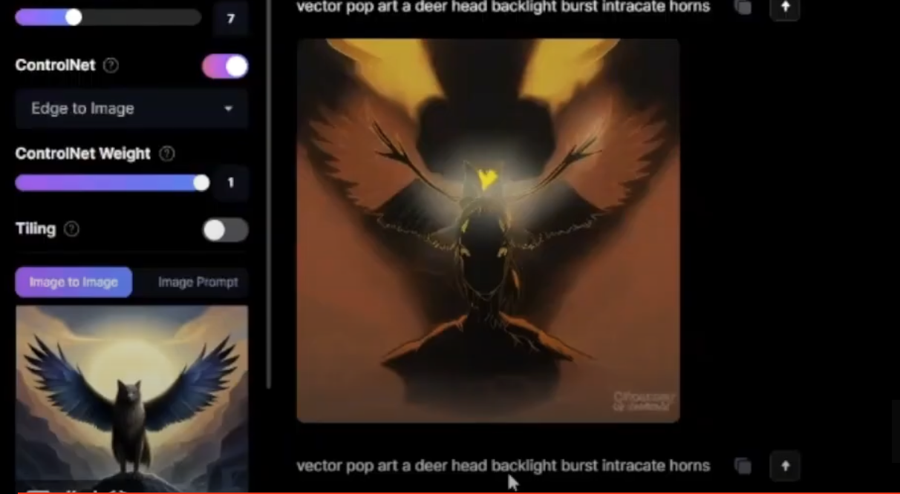
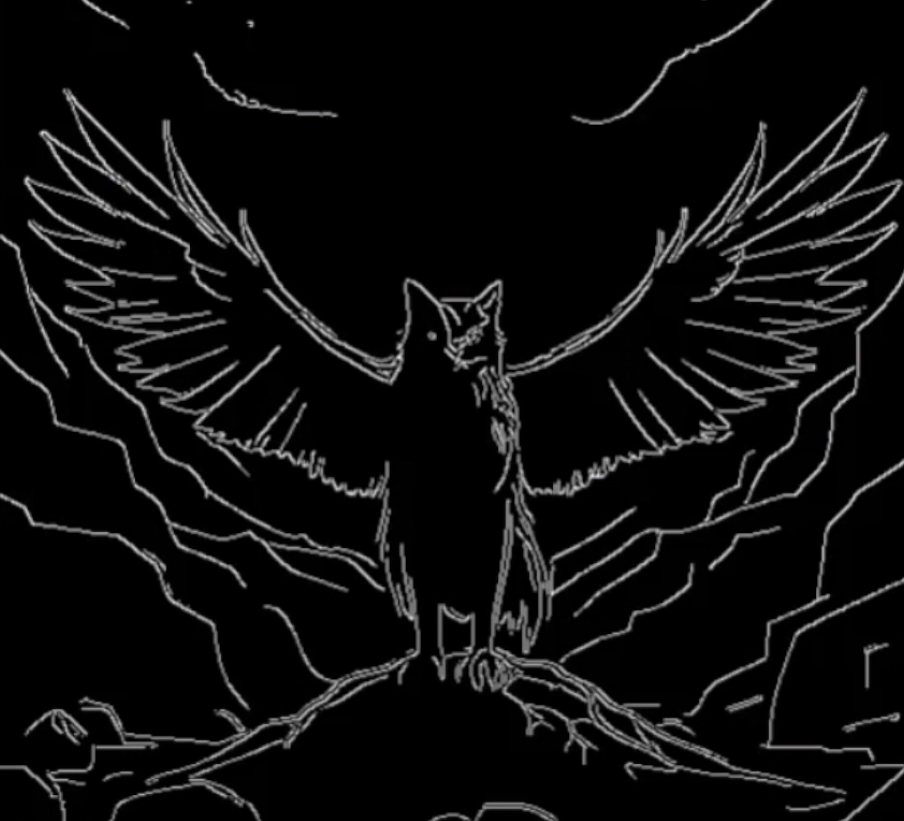
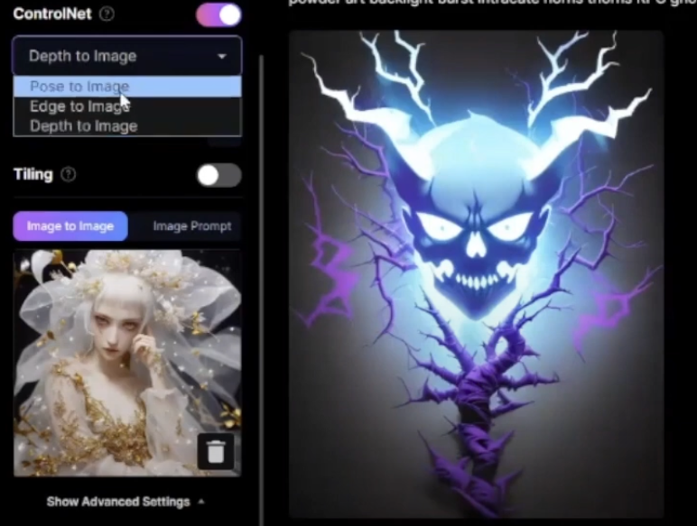
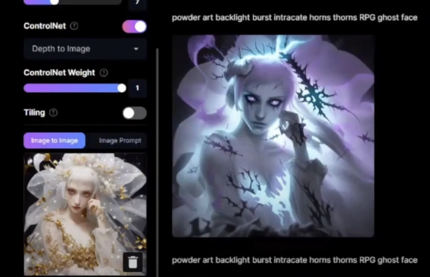
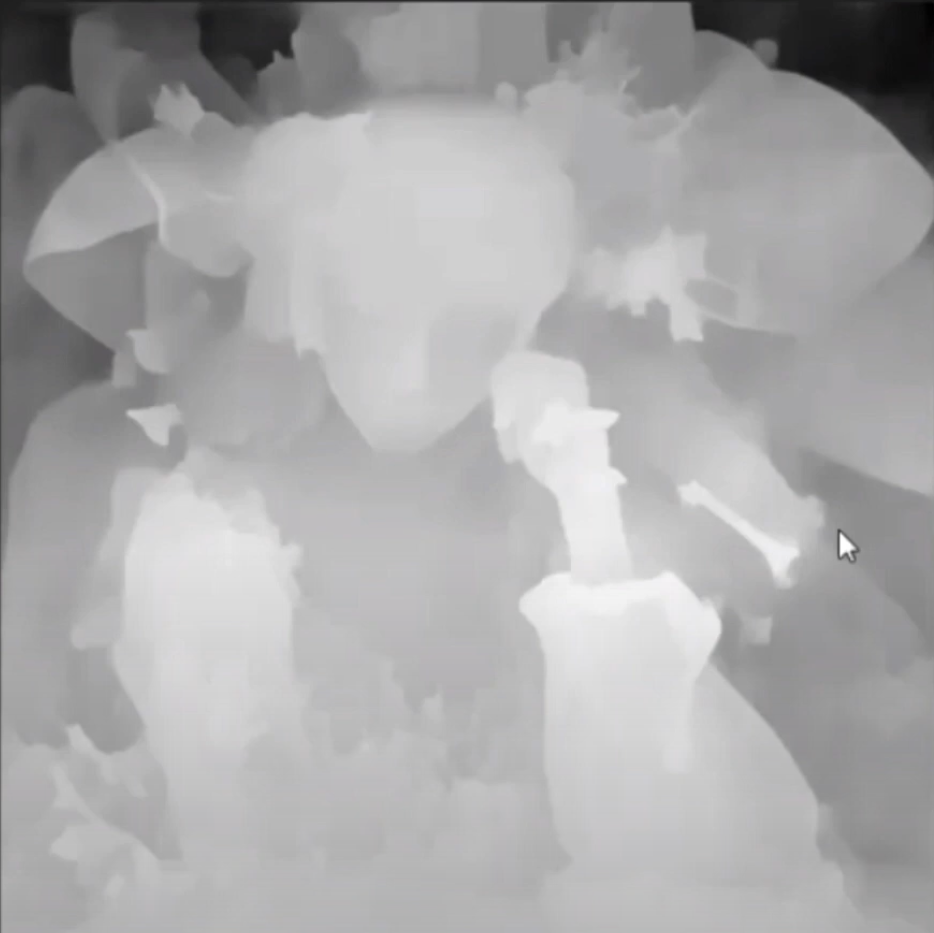

# how to control your model

## how a model be trained

By utilizing billions of images, each accompanied by textual labels, we employ statistical principles to train and identify patterns. Every model almost be trained base a basic model named Diffusion Model.

## how a model generate image

The steps involved in generating images with the model are as follows: starting from a noisy image, gradually generating an image. During this process, We need to employ some methods to interfere with the image generation of the model.

if we use image to image. It actually reduce the step from noise to image. In other words, if using image to generate image, the base noise image is more clear:

## how we control?

prompt, guidance scale and so some other parameters:

* Image Dimensions: the first thing model need to confirm. it is like a white paper size, which a drawer need to confirm firstly. Each model has showed its train size:

the recommendation size is 512*512. because most of models support this size. if you want to use other size, the image generated may more chaos.

* prompt: place the important content at the forefront.  same prompt in different models, the weight of it is not different. Don't care your grammar is good or not, all prompt will pass to Text Encoder to encode to the language machine understand. The third line prompt is almost not work. So need to use not only the prompt but controlNet and other parameters to control.
* Guidance Scale: total weight of your prompt. More less, meaning the model need more less itself thinking.
* init strength: how strong the basic image noise is, the more strong, the more clear the basic image is:

* ControlNet:
  * Pose to Image: generate the image by its pose, if use it, you could not write pose on your prompt:  
  * Edge to Image: model will get the image person's edge and generate a image depends its edge, the example below generate image which has the same contour: 
  actually model first pre-handle the original image, transfer it to this:
   then generate a new image
  * Depth ot image: generate a image depends its depth, the example below generate image which without depth: , now with depth: . it pre-handle to below image with before or behind relation: 

## reference

[youtube](https://www.youtube.com/watch?v=ozrUGL4EV4M)