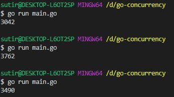
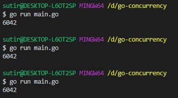

# Atomic Operations

## what is atomic operation

Atomic operations are more primitive than other synchronization techniques. They are lockless and generally implemented directly at hardware level. In fact, they are often used in implementing other synchronization techniques.

If we do an operation like increment or decrement using **channels** on a single shared variable, the **goroutines** will not be synchronized and will produce erroneous output. The atomic operations, on the other hand, are implemented at the hardware level. That means when we create a shared atomic variable and use multiple goroutines to update its value it will be updated correctly.

## how to use

The package contains load, store and the addition operation for the int32, int 64, uint32, uint64, etc. Since only ints are such primitive that can be correctly synchronized using atomics.

```go
package main

import (
    "fmt"
    "sync"
    // "sync/atomic"
)

func f(v *int, wg *sync.WaitGroup) {
    for i := 0; i < 3000; i++ {
        *v++
    }
    wg.Done()
}

func main() {
    var v int = 42
    var wg sync.WaitGroup
    wg.Add(2)
    go f(&v, &wg)
    go f(&v, &wg)
    wg.Wait()

    fmt.Println(v)
}

```



As can be seen each time the program is run it will produce the wrong output. It happens due to the fact the goroutines accessing and changing the value is not synchronized. So, the changed values are arbitrary and will result in the wrong number of operations.

Now, we convert the code above to synchronized code using atomic.

```go
package main

import (
    "fmt"
    "sync"
    "sync/atomic"
)

func f(v *uint32, wg *sync.WaitGroup) {
    for i := 0; i < 3000; i++ {
        atomic.AddUint32(v, 1)
    }
    wg.Done()
}

func main() {
    var v uint32 = 42
    var wg sync.WaitGroup
    wg.Add(2)
    go f(&v, &wg)
    go f(&v, &wg)
    wg.Wait()

    fmt.Println(v)
}
```



## Use of atomic operations in GoLang

Atomic operations are used when we need to have a shared variable between different goroutines which will be updated by them. If the updating operation is not synchronized then it will create a problem that we saw.

Atomic operations solve that problem by synchronizing access to the shared variable and making the output correct.