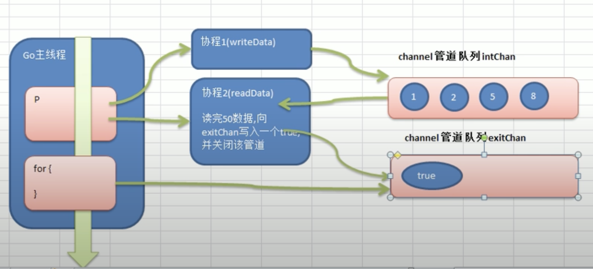

# Channel Applications

## application 1



```go
package main
import (
	"fmt"
	"time"
)


//write Data
func writeData(intChan chan int) {
	for i := 1; i <= 50; i++ {
		//放入数据
		intChan<- i //
		fmt.Println("writeData ", i)
	}
	close(intChan) //关闭
}

//read data
func readData(intChan chan int, exitChan chan bool) {

	for {
		v, ok := <-intChan
		if !ok {
			break
		}
		fmt.Printf("readData 读到数据=%v\n", v)
	}
	//readData 读取完数据后，即任务完成
	exitChan<- true
	close(exitChan)

}

func main() {

	//创建两个管道
	intChan := make(chan int, 10)
	exitChan := make(chan bool, 1)

	go writeData(intChan)
	go readData(intChan, exitChan)

	for {
		_, ok := <-exitChan
		if !ok {
			break
		}
	}

}
```

## output

```data
writeData  1
writeData  2
writeData  3
writeData  4
writeData  5
writeData  6
writeData  7
writeData  8
writeData  9
writeData  10
writeData  11
readData 读到数据=1
readData 读到数据=2
readData 读到数据=3
readData 读到数据=4
readData 读到数据=5
readData 读到数据=6
readData 读到数据=7
readData 读到数据=8
readData 读到数据=9
readData 读到数据=10
readData 读到数据=11
readData 读到数据=12
writeData  12
writeData  13
writeData  14
writeData  15
writeData  16
writeData  17
writeData  18
writeData  19
writeData  20
writeData  21
writeData  22
writeData  23
readData 读到数据=13
readData 读到数据=14
readData 读到数据=15
readData 读到数据=16
readData 读到数据=17
readData 读到数据=18
readData 读到数据=19
readData 读到数据=20
readData 读到数据=21
readData 读到数据=22
readData 读到数据=23
readData 读到数据=24
writeData  24
writeData  25
writeData  26
writeData  27
writeData  28
writeData  29
writeData  30
writeData  31
writeData  32
writeData  33
writeData  34
writeData  35
readData 读到数据=25
readData 读到数据=26
readData 读到数据=27
readData 读到数据=28
readData 读到数据=29
readData 读到数据=30
readData 读到数据=31
readData 读到数据=32
readData 读到数据=33
readData 读到数据=34
readData 读到数据=35
readData 读到数据=36
writeData  36
writeData  37
writeData  38
writeData  39
writeData  40
writeData  41
writeData  42
writeData  43
writeData  44
writeData  45
writeData  46
writeData  47
readData 读到数据=37
readData 读到数据=38
readData 读到数据=39
readData 读到数据=40
readData 读到数据=41
readData 读到数据=42
readData 读到数据=43
readData 读到数据=44
readData 读到数据=45
readData 读到数据=46
readData 读到数据=47
readData 读到数据=48
writeData  48
writeData  49
writeData  50
readData 读到数据=49
readData 读到数据=50
----------------------%t---------------------- true
----------------------%t---------------------- false

Program exited.
```
