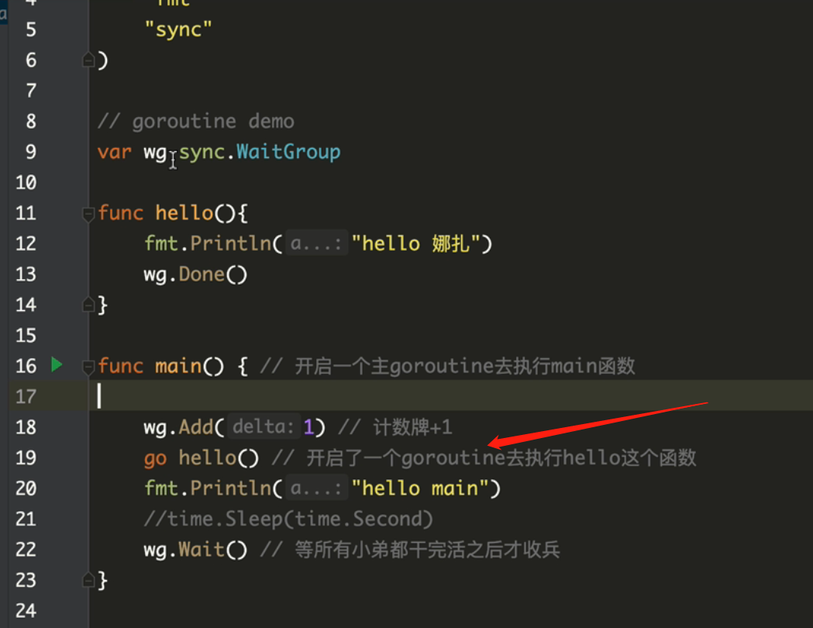

# goroutine

golang could open many threads by named goroutine:

we use the keyword `go` to create a thread:

but there will have some problems:

different goroutine comminicates with each other by global variable like above code `wg`. But if many goroutines to access the same variable, it will cause data problems. So we need to use lock. But lock is heavy. So we need to consider `channel`
