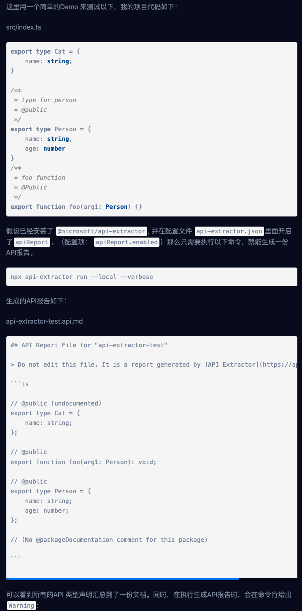

# 前端开发者如何用 API Extractor 管理 API？




```
Warning: src/index.tsx:1:1 - (ae-missing-release-tag) "Cat" is exported by the package, but it is missing a release tag (@alpha, @beta, @public, or @internal)
```


## reference

[知乎](https://zhuanlan.zhihu.com/p/434565485)