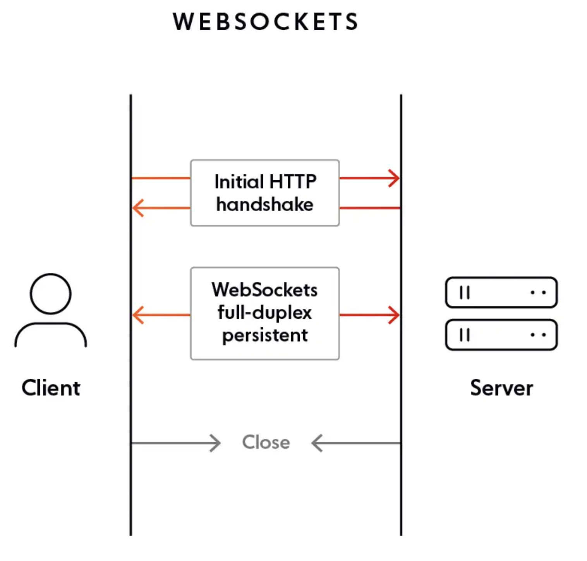

# websocket connetion

WebSockets allow both the server and the client to push messages at any time without any relation to a previous request. One notable advantage of using WebSockets is, almost every browser supports WebSockets.

## WebSocket solves a few issues with HTTP:

* Bi-directional protocol – either client/server can send a message to the other party (In HTTP, the request is always initiated by the client and the response is processed by the server – making HTTP a uni-directional protocol)

* Full-duplex communication – client and server can talk to each other independently at the same time.

* Single TCP connection – After upgrading the HTTP connection in the beginning, client and server communicate over that same TCP connection (persistent connection) throughout the lifecycle of WebSocket connection.

## WebSocket Pros

* WebSocket is an event-driven protocol, which means you can actually use it for truly realtime communication. Unlike HTTP, where you have to constantly request updates, with websockets, updates are sent immediately when they are available.

* WebSockets keeps a single, persistent connection open while eliminating latency problems that arise with HTTP request/response-based methods.

* WebSockets generally do not use XMLHttpRequest, and as such, headers are not sent every-time we need to get more information from the server. This, in turn, reduces the expensive data loads being sent to the server.

## WebSocket Cons

WebSockets don’t automatically recover when connections are terminated – this is something you need to implement yourself, and is part of the reason why there are many client-side libraries in existence.

Browsers older than 2011 aren’t able to support WebSocket connections – but this is increasingly less relevant.

## reference

[blog](https://ably.com/topic/websockets-vs-http#web-sockets)
