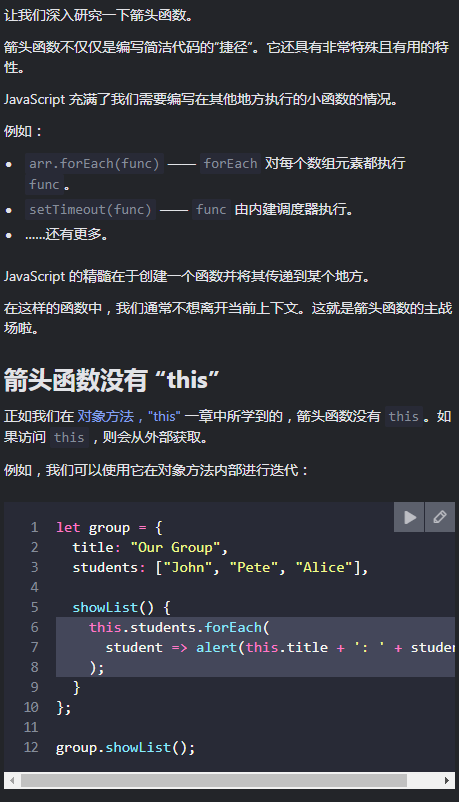
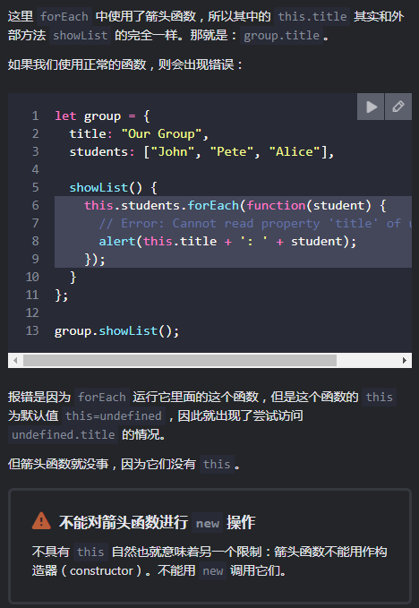
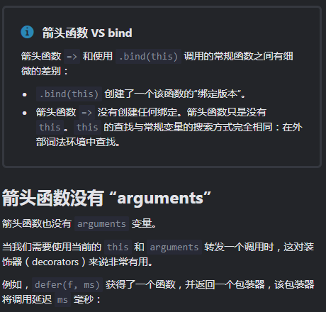
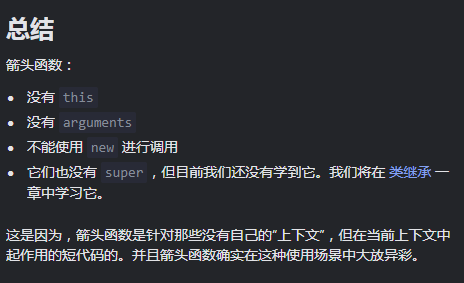

# arrow function 箭头函数

箭头函数相当于匿名函数,但和匿名函数的区别在于this





```JavaScript
function defer(f, ms) {
  return function() {
    setTimeout(() => f.apply(this, arguments), ms);
  };
}

function sayHi(who) {
  alert('Hello, ' + who);
}

let sayHiDeferred = defer(sayHi, 2000);
sayHiDeferred("John"); // 2 秒后显示：Hello, John
```

不用箭头函数的话，可以这么写：

```JavaScript
function defer(f, ms) {
  return function(...args) {
    let ctx = this;
    setTimeout(function() {
      return f.apply(ctx, args);
    }, ms);
  };
}
```

