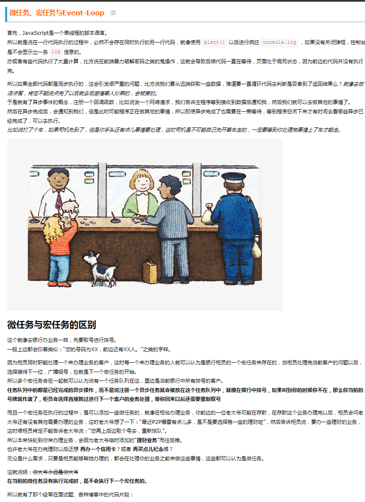
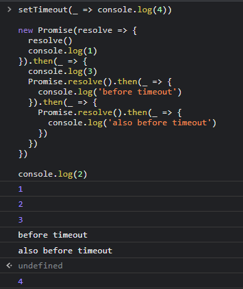
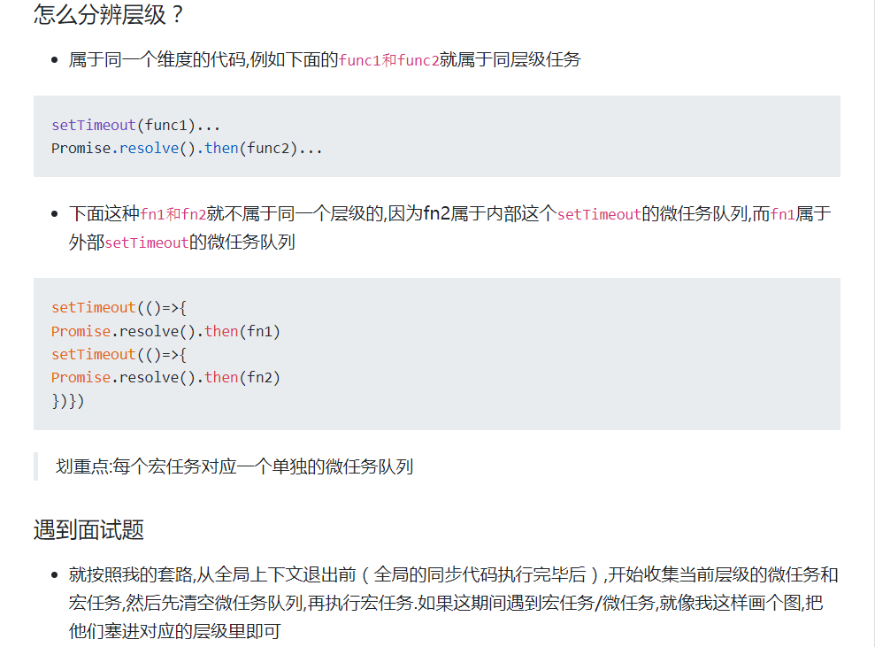

# 微任务、宏任务与Event-Loop



上面打码输出结果:


所以根据上面总结:
每个层级的宏任务,都对应了他们的微任务队列,微任务队列遵循先进先出的原则,当全局同步代码执行完毕后,就开始执行第一层的任务。同层级的微任务永远先于宏任务执行,并且会在当前层级宏任务结束前全部执行完毕



```javascrit
setTimeout(_ => console.log('setTimeout'))
setImmediate(_ => console.log('setImmediate'))

let countdown = 1e9

while(countdonn--) { } // 我们确保这个循环的执行速度会超过定时器的倒计时，导致这轮循环没有结束时，setTimeout已经可以执行回调了，所以会先执行`setTimeout`再结束这一轮循环，也就是说开始执行`setImmediate`
```


## reference

[someone's blog](https://www.cnblogs.com/jiasm/p/9482443.html)
[someone's blog](https://segmentfault.com/a/1190000039055443)
