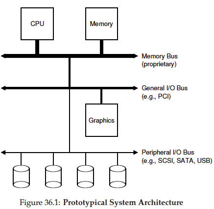
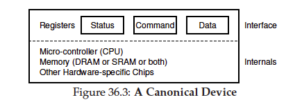
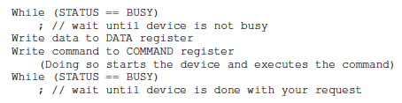

## I/O

### file descriptors（APUE）

To the kernel, all open files are referred to by file descriptors. A file descriptor is a non-negative integer. When we open an existing file or create a new file, the kernel returns a file descriptor to the process.

A file is opened or created by calling either the **open** function or the **openat** function.

The file descriptor returned by open and openat is guaranteed to be the lowestnumbered unused descriptor. For example, an application
might close standard output — normally, file descriptor 1—and then open another file, knowing that it will be opened on file descriptor 1.

### architecture (OSTEP)

system designers have adopted this hierarchical approach, where components that demand high performance (such as the graphics card) are nearer the CPU. Lower performance components are further away

Of course, modern systems increasingly use specialized chipsets and faster point-to-point interconnects to improve performance. Such as graphics.

The CPU connects to an I/O chip via Intel’s proprietary DMI (Direct Media Interface), and the rest of the devices connect to this chip via a number of different interconnects.

### A Canonical Device (OSTEP)

拿一个抽象的例子来理解I/O

设备通过interface和操作系统内部打交道。 设备需要需要三个registers组成： status, command, data. status是告诉操作系统该设备的状态，是忙还是闲等，command就是操作系统需要告诉设备进行哪些任务操作

### interrupt

操作系统为了能感知一个I/O设备的状态，首先考虑的是轮询polling。 但是轮询消耗大量cpu资源。 一些工程师想到了用the interrupt.

the OS can issue a request, put the calling process to sleep, and context switch to another task. When the device is finally finished with the operation, it will raise a hardware interrupt, causing the CPU to jump into the OS at a predetermined interrupt service routine (ISR) or more simply an interrupt handler. The handler is just a piece of operating system code that will finish the request (for example, by reading data and perhaps an error code from the device) and wake the process waiting for the I/O, which can then proceed as desired.

### Direct Memory Access (DMA)

当进行大量数据的IO时候，interrupt也不是一个好的方法。

DMA works as follows. To transfer data to the device, for example, the OS would program the DMA engine by telling it where the data lives in memory, how much data to copy, and which device to send it to. At that point, the OS is done with the transfer and can proceed with other work. When the DMA is complete, the DMA controller raises an interrupt, and
the OS thus knows the transfer is complete.

## 网络I/O 类型

* 阻塞IO模型
* 非阻塞IO模型
* 多路复用IO模型
* 信号驱动IO模型
* 异步IO模型

（1）同步和异步的概念描述的是用户线程与内核的交互方式：

同步是指用户线程发起IO请求后需要等待或者轮询内核IO操作完成后才能继续执行；
异步是指用户线程发起IO请求后仍继续执行，当内核IO操作完成后会通知用户线程，或者调用用户线程注册的回调函数。

（2）阻塞和非阻塞的概念描述的是用户线程调用内核IO操作的方式：

阻塞是指IO操作需要彻底完成后才返回到用户空间；
非阻塞是指IO操作被调用后立即返回给用户一个状态值，无需等到IO操作彻底完成。

（3）多路复用I/O

I/O多路复用就通过一种机制，可以监视多个描述符，一旦某个描述符就绪（一般是读就绪或者写就绪），能够通知程序进行相应的读写操作。

（4）事件驱动I/O

事件驱动I/O本质上就是将I/O操作转化为程序需要处理的事件，减少了等待机制，而是利用事件触发的机制，增加了效率。

### select-同步阻塞&多路复用I/O

select 实现多路复用的方式是：将已连接的 Socket 都放到一个文件描述符集合，然后调用 select 函数将文件描述符集合拷贝到内核里，让内核来检查是否有网络事件产生，检查的方式很粗暴，就是通过遍历文件描述符集合的方式，当检查到有事件产生后，将此 Socket 标记为可读或可写， 接着再把整个文件描述符集合拷贝回用户态里，然后用户态还需要再通过遍历的方法找到可读或可写的 Socket，然后再对其处理。

select 使用固定长度的 BitsMap，表示文件描述符集合，而且所支持的文件描述符的个数是有限制的，默认最大值为 1024，只能监听 0~1023 的文件描述符。

如图，对于 select 这种方式，需要进行 2 次遍历文件描述符集合，一次是在内核态里，一个次是在用户态里 ，而且还会发生 2 次拷贝文件描述符集合，先从用户空间传入内核空间，由内核修改后，再传出到用户空间中。

### poll-同步阻塞&加强版多路复用I/O

poll 不再用 BitsMap 来存储所关注的文件描述符，取而代之用动态数组，以链表形式来组织，突破了 select 的文件描述符个数限制，当然还会受到系统文件描述符限制。
但是 poll 和 select 并没有太大的本质区别，都是使用线性结构存储进程关注的 Socket 集合，因此都需要遍历文件描述符集合来找到可读或可写的 Socket，时间复杂度为 O(n)，而且也需要在用户态与内核态之间拷贝文件描述符集合，这种方式随着并发数上来，性能的损耗会呈指数级增长。

### epoll-同步阻塞&加强版多路复用&事件驱动I/O

epoll 相比 select/poll增强了这两个方面：

* 第一点，epoll 在内核里使用红黑树来跟踪进程所有待检测的文件描述字，把需要监控的 socket 通过 epoll_ctl() 函数加入内核中的红黑树里，红黑树是个高效的数据结构，增删查一般时间复杂度是 O(logn)，通过对这棵黑红树进行操作，这样就不需要像 select/poll 每次操作时都传入整个 socket 集合，只需要传入一个待检测的 socket，减少了内核和用户空间大量的数据拷贝和内存分配。
* 第二点， epoll 使用事件驱动的机制，内核里维护了一个链表来记录就绪事件，当某个 socket 有事件发生时，通过回调函数内核会将其加入到这个就绪事件列表中，当用户调用 epoll_wait() 函数时，只会返回有事件发生的文件描述符的个数，不需要像 select/poll 那样轮询扫描整个 socket 集合，大大提高了检测的效率。

epoll 的方式即使监听的 Socket 数量越多的时候，效率不会大幅度降低，能够同时监听的 Socket 的数目也非常的多了，上限就为系统定义的进程打开的最大文件描述符个数。因而，epoll 被称为解决 C10K 问题的利器。

## reference

[blog](https://juejin.cn/post/7120907747498934280)