# 工作日志

[toc]

## 1. [录音编码中bug](http://tapd.oa.com/TIM_web/bugtrace/bugs/view/1010143861085157087)

工作流程：
* 以为x5内核问题。通过和shuda和产品对接，将非x5内核的录音功能置灰。但是发现即使x5内核有的机型也会出现该问题
* 所以会不会是其他bug + 上述bug，两个bug叠加？
* 又收到两份bug单，环境一个是x5内核，一个是企业微信，均出现该问题
* 所以目前确定，非X5内核一定不行，但是x5内核部分不行
* 发现手上的onePlus和Huawei测试环境会一直编码中，但是现网没问题
* 找paddy导师研究为什么测试环境会出现问题-->发现`npm run compile`编译导致涉及到`worker`代码报错`Uncaught SyntaxError: Unexpected identifier`， 已经将该问题报告给glendon
* 手上没有任何机型可以复现x5内核环境下的bug，联系测试复现，得到回复该bug已经自己好了
* 推测可能这期间他们进行了一些操作，使手机装了x5内核。要求他们重新安装QQ，发现bug又复现
* 通过发送日志的方式，查到当卸载重装QQ后，因为x5内核没安装，bug复现
* 所以最后确定可能原因就是x5内核的有无导致bug

* 时隔三个月，又出现了该bug，修改方式如下：

```
https://git.woa.com/tencent-doc-core/melo/merge_requests/4688/diffs

webpack改造后直接引用了node module，但是其实录音feature的写法不规范，是基于global引入的一些特点来写的，导致调用出错。后续需要改造这个feature，lamejs也应该采用按需加载的模式载入。
```

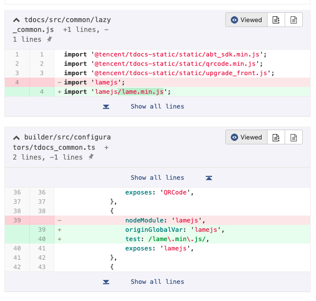

* [参考1](https://www.jianshu.com/p/1b90743386b2)
* [参考1-github库](https://github.com/xiangyuecn/Recorder)
* [参考2](https://segmentfault.com/a/1190000018891445)
* [参考3](https://www.cnblogs.com/Wayou/p/js_audio_recorder.html)
* [参考4](https://www.jianshu.com/p/1b90743386b2)
* [MDN](https://developer.mozilla.org/en-US/docs/Web/API/Web_Audio_API)
* [MDN](https://developer.mozilla.org/en-US/docs/Web/API/AudioContext)
* [参考5](https://segmentfault.com/a/1190000018809821)

总结：

* 学习`worker`内容
* 梳理web`录音机`内容
* 观看上述参考文献
* 不怕犯错，不怕麻烦，就怕同样的错误同样犯 --paddy

## 2. [PDF生成副本](http://tapd.oa.com/my_worktable?source_user=1001425640&workspace_id=10143861&workitem_type=story&workitem_id=1010143861862946547#&filter_close=true)

工作流程：

* 研究word的生成副本代码：

## 3.[企业微信录音字样未对齐](http://tapd.oa.com/TIM_web/bugtrace/bugs/view/1010143861085133863)

工作流程：

* 研究如何企业微信debug,询问后发现企业微信很难debug。尝试其他平台，app可以复现该bug
* 直接尝试CSS样式，解决问题

总结：

* 也没啥好总结的，字样面板问题CSS肯定能解决

## 4. 尝试优化Audio Recorder

* YouTube上第一个视频 [Web Audio API Tutorial](https://www.youtube.com/watch?v=p0Fv9CX1FGc) ,只需要看里面涉及到的几个概念
* 对上述视频中的Node进行: [解释](https://segmentfault.com/a/1190000018809821) 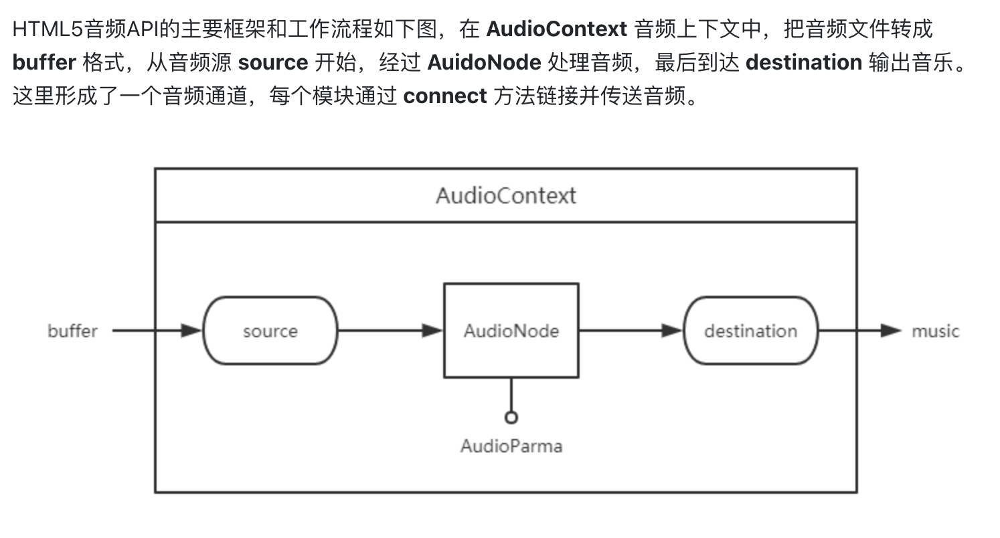
* 了解完基本概念后，详细了解[AudioContext标准](https://www.html5rocks.com/en/tutorials/webaudio/intro/#toc-context)
* 请教了`farrenhuang`，梳理了下audio的很多class：

```
AudioManager is a parent class, which has two subclass: AudioRecordManager and AudioPlayManager. One of them is
recorder, and the other is play the recorder.
```

## 5. [切换到手机摄像开启后，录音自动关闭](http://tapd.oa.com/TIM_web/bugtrace/bugs/view/1010143861085205475)

* 定位到process()代码， 但是怎么能模拟出开摄像头切环境呢
* 理解错了。 原来切换app后，app还是会一直跑的。 用手机就行
* 出现权限被占用，会跑到`this.error(this.nativeToAudioError(res.error));`
* 突然意识到，是不是应该看一遍出bug时候的代码流程，再比较下没有切APP时候关录音时候正常的代码流程，比较下
* 比较后发现bug机型直接把权限拿走？，导致报错`error`,走到`this.error(this.nativeToAudioError(res.error));`， 但是app还是在持续录音
* 通过写入下述代码可以解决问题，但是可否考虑修复为一直在录音中 --> 安卓系统只给一个录音app权限

```
if (AudioManager.getInstance().recording) {
    AudioManager.getInstance().stopRecord();
 }
```

* 考虑`component`的问题，看看录音面板消失后，HTML标签还在不 --> 不在了，被删了。
* 考虑是否可以暂停录音 --> stop和pause是一种东西
* 代码写到`audio_recorder`有点别扭，因为会向上抛出
* 但是不能在最顶层`audioManager`里面stop，因为返回的error的show属性是false
* 看到错误码是1880004，联系客户端，是他们返回来的错误，错误代码含义：focus改变
* 单测写了好久， mock一个类的几种方法：

```javascript
1.
jest.mock('~melo-features/features/common/audio/manager/audio_manager', () => {
    const originalModule = jest.requireActual('~melo-features/features/common/audio/manager/audio_manager');
    return {
        __esModule: true,
        ...originalModule,
        AudioManager: {
            stopRecord: jest.fn(),
            recording: true,
            getInstance: () => ({
                stopRecord: jest.fn(),
                recording: true,
            }),
        },
    };
});

// 直接mock类里面的一个方法
2.
describe('test stopRecord will be called when error code is 1880004', () => {
    let manager: AudioManager;
    beforeAll(() => {
        createWorkbench();
        manager = AudioManager.getInstance();
    });

    test('stopRecord is called', () => {
        manager.stopRecord = jest.fn();
        // ts-ignore
        Object.defineProperty(manager, 'recording', {
            get: jest.fn(() => true),
        });

        new IOSAudioRecorder().nativeToAudioError(1880004);
        expect(AudioManager.getInstance().stopRecord).toBeCalled();
    });
});

```

* 改的不对，要重新加个enmu

## 6. [PDF, Word弹窗](http://tapd.oa.com/TIM_web/prong/stories/view/1010143861862778029)

* 产品反映： word弹出窗口会很慢，PDF弹窗太快， 只能请教bert，因为该需求是他所写.
* PDF采用在加载完时候发出`event`形式:

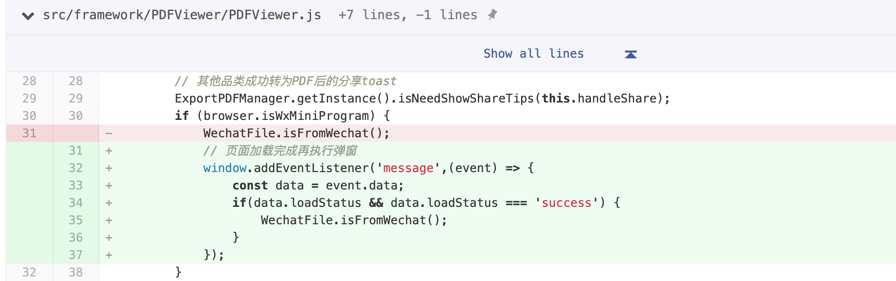

* word较为复杂，涉及到将mobile加载从`level2`调到`level1`

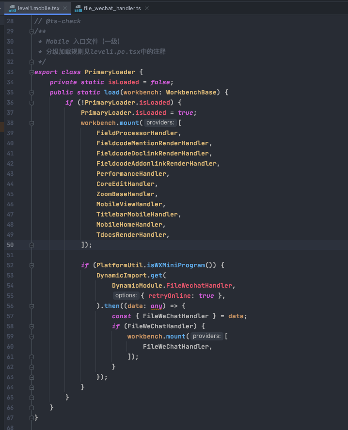

## 7. [录音与录音转文字需求同时开启](hhttp://tapd.oa.com/TIM_web/bugtrace/bugs/view/1010143861085606203)

* 一直在调试如何修改，加代码验证。联系产品确认需求， 结果产品说他的能同时用。然后发现我手机也能同时用。
* 问了测试发现其手机可以复现

## 8. [Drive分享](http://tapd.oa.com/TIM_web/prong/stories/view/1010143861863628837)

* 工作评估要找熟悉该代码的人沟通

TODO:

* share关键词已经被用，需要改
* 多文件时候如果不选任何文件，怎么办？置灰？
* 现在要研究melo怎么发送请求分享

## 9. [单测集训](https://git.code.oa.com/tencent-doc-core/melo/merge_requests/4473)

* 峰哥说： 基于过程做测试是不太靠谱的，应该基于结果去做。下次单测集训可以多考虑下，必要也可以修改一下原本被测的方法使其更具有可测性

## 10. [信息面板 word](http://tapd.oa.com/TIM_web/prong/stories/view/1010143861863523965)

* 先解决移动端，因为移动端是组件
* 问产品icon在哪里，他说在视觉稿里（下次先自己看）
* 移动端分为H5和小程序，所以信息面板该以which situation to show
* 与峰哥讨论得出结论用[WidgetService](http://workbench.pages.oa.com/classes/widgetservice.html)去承接该页面
* 一个新的feature加入到melo，要在`level2`等文件添加该handle，并在`melo-feature`目录下跑`tnpm run add:melo`
* 最好在转测试后再跑`tapd`流程，因为真的会有很多问题！！！
* pc端完成目前出现问题： react内存泄露

```
  raven.min.js?71cd:2 Warning: Can't perform a React state update on an unmounted component. This is a no-op, but it indicates a memory leak in your application. To fix, cancel all subscriptions and asynchronous tasks in the componentWillUnmount method.
      in PcMenuFileInfo (created by FileInfoShortVersionInMenu)
      in div (created by FileInfoShortVersionInMenu)
      in FileInfoShortVersionInMenu
      in Pc (created by n)
      in li (created by Context.Consumer)
      in div (created by Context.Consumer)
      in t (created by Context.Consumer)
      in t (created by n)
      in ul (created by Context.Consumer)
      in t (created by n)
      in n (created by n)
      in div (created by Context.Consumer)
```

* 在debug后，找到问题出在组件被卸载后，内置的`promise`或`setTimeout`依旧在运行，导致`setState`被触发但是组件已经被卸载
  [Link](https://medium.com/@shanplourde/avoid-react-state-update-warnings-on-unmounted-components-bcecf054e953)
  该问题学到`用debug方式研究组件的生命周期`
* 他人定义什么接口，传参时候就用什么接口
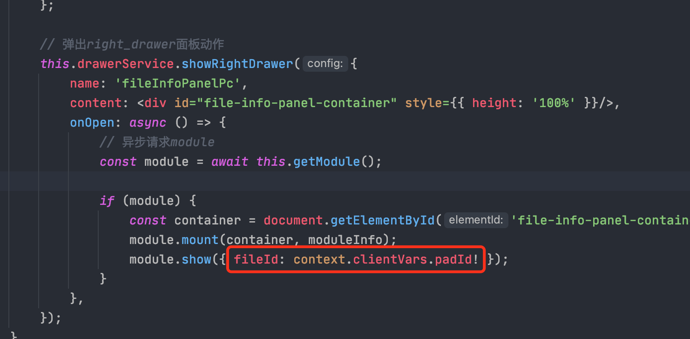
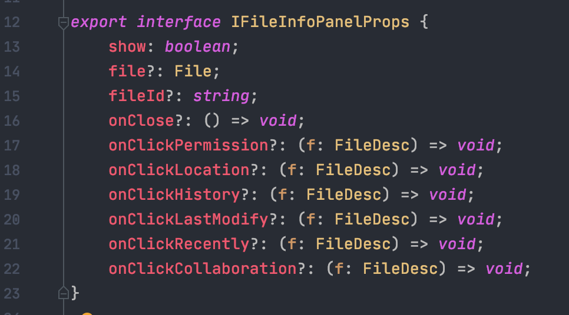
如图直接传`module.show({ context.clientVars.padId! })`是错误的
* pc端该需求遇到问题：
在melo下调用`showDrawer`后调用fc的`mount(container)`方法render。在调用`closeDrawer`后，melo会卸载掉div，但是fc组件那边
依然以为melo并未卸载，此时要在调用`closeDrawer`前调用`unmount`或`remove`方法先卸载fc的组件
还有问题要注意： 每次跳转其他auth或者revision时候也要调用remove，卸载，因为此时最外面的div已经卸载

## 11. [信息面板 pdf](http://tapd.oa.com/TIM_web/prong/stories/view/1010143861863524509)

* 该需求分为两个部分:
  * 菜单项
  * right sidebar

菜单项遇到的问题：

1、 如何把component组件渲染到菜单上： 不知道怎么解决的，他就是能渲染成组件。 但是不能覆盖prototype

right sidebar问题：

1. 点击'i'，菜单并没关闭。解决方案：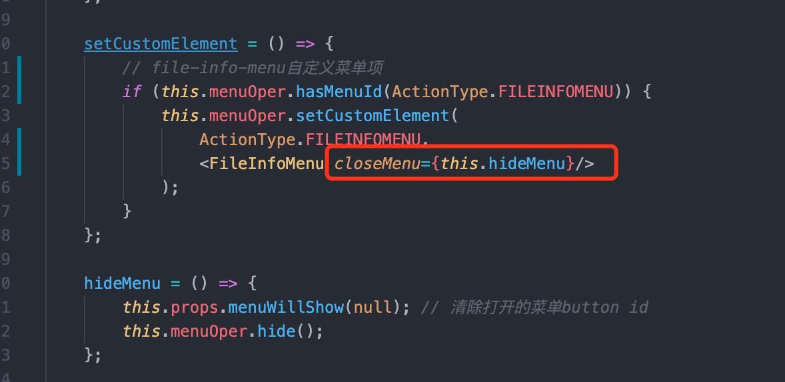 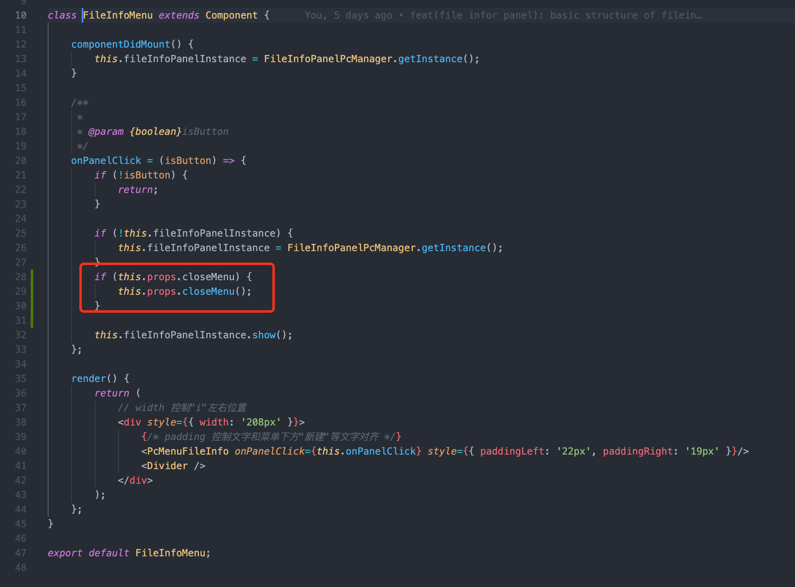

2. 遇到的第二个问题：信息面板关闭后，其实并没关闭，`display`仍然是`block`

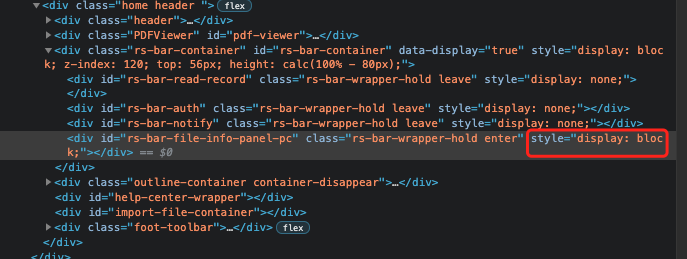

初步判断是因为在`side-bar`没处理state.

解决办法:

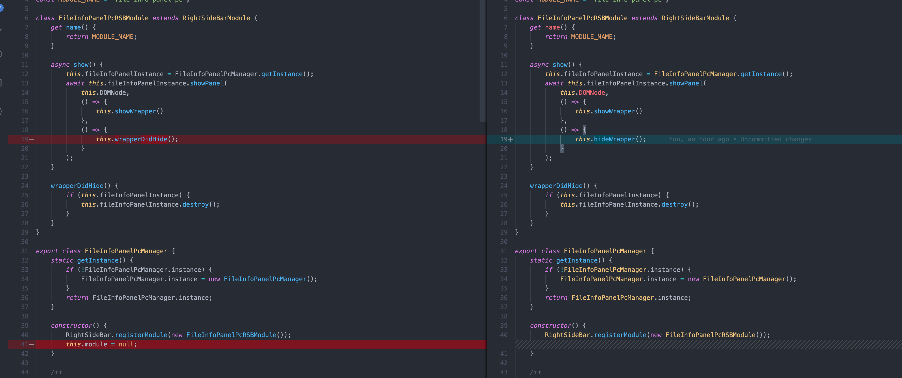

## 12. [导出失败](http://tapd.oa.com/TIM_web/bugtrace/bugs/view/1010143861087106911)

导出word，弹出`导出失败。`, 经过排查前端拿到的状态是成功状态。

打开Excel 发现同样导出会失败。

## 13. [导出失败](http://tapd.oa.com/10143861/bugtrace/bugs/view?bug_id=1010143861088052789&url_cache_key=bc4aff7f60d26198206c2748174a8625&action_entry_type=bugs)

* 导出失败，有时候成功有时候失败。
* 要确定好责任，这边没问题就找后台。 导出有时候成功有时候失败，url没啥问题那就拉群，找相关责任人。省的耽误自己时间

## 14. [列表页"..."菜单栏](http://tapd.oa.com/TIM_web/prong/stories/view/1010143861865406451)

单测如何拿到`props`的内容

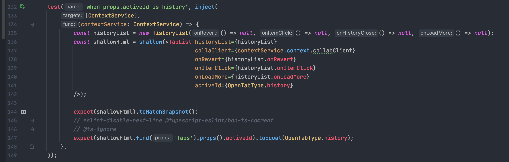

别忘了配置：

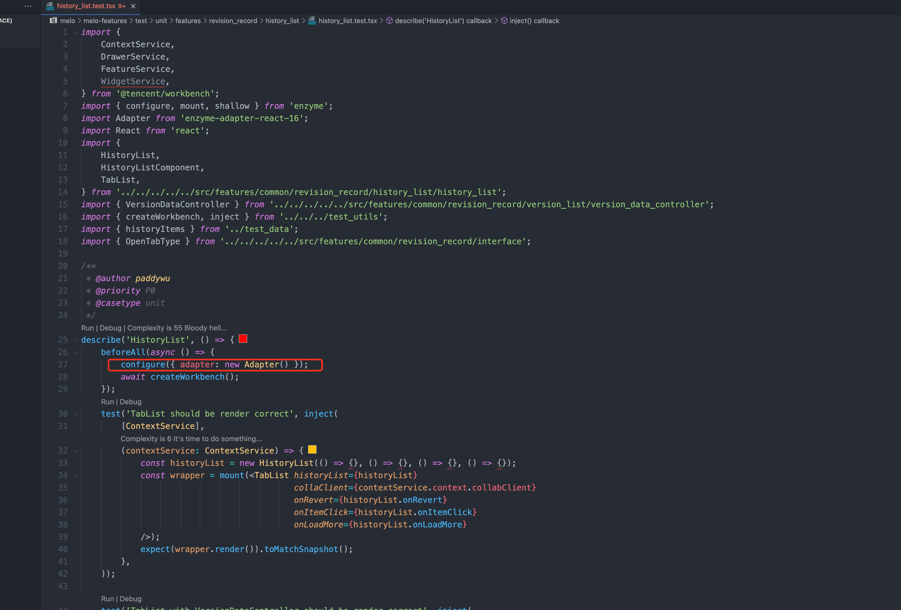

1. 沟通很重要，这次需求评审过于短，又没及时和产品沟通，他们以为能按时交付，但是延期了很久。
2. 任何事情理由都要充分。一定要考虑好如果回复别人挑战你的观点

怎么拿到一个mock方法传进去的参数：
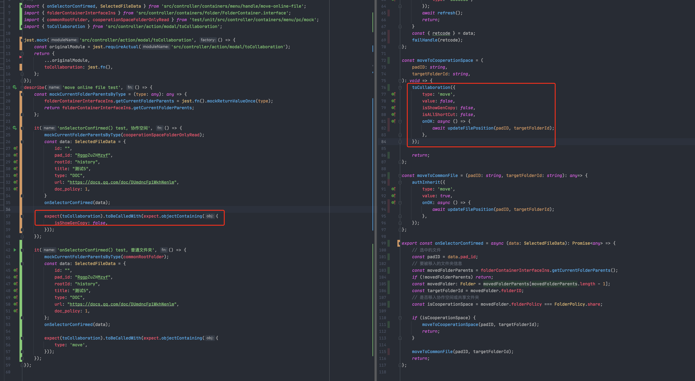
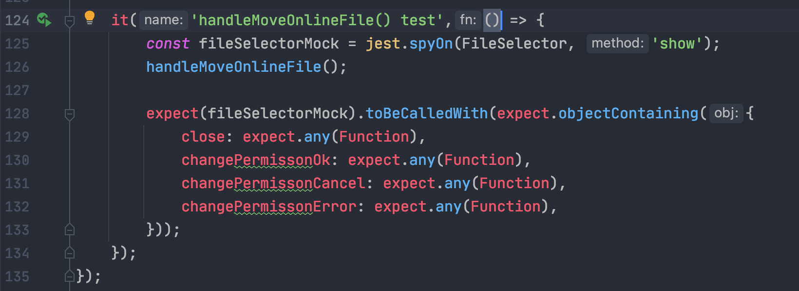

如果遇到chrome搜不到文件情况，记得把ignore清单给移除掉js

## 15.[导出失败](http://tapd.oa.com/TIM_web/bugtrace/bugs/view/1010143861088839199)

* 一开始以为是接口问题，换了个新接口就行了
* 测试找上来想到远远没有这么简单
* 每次pc端调用的一直是新接口，但是这边下来的url还是老接口的url。但是为什么老的url有的可以下载有的不行呢？

## 16.\b的bug

* 拿到复现该bug的文档粘贴到文档编辑器，看到的\b是<0x08>十六进制的数，所以研究这个<0x08>是什么
* ascii表格里面0x08是bs（backspace)退格

## 17. 段落快捷操作

* 有猜测就要有验证. 图片svg背景色一直是白色，猜测是设计给图问题，然后就去设置一个背景色给他去验证
* render_component不能依赖workbench，因为workbench很大加载的时机会很晚。
