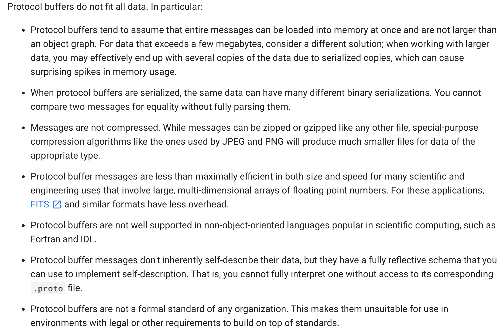

# protocol buffer

it could serializing structured data in forward-compatible and backward-compatible way.

## What Problems do Protocol Buffers Solve?

provide a serialization format for packets of typed, structured data that are up to a few megabytes in size. The format is suitable for both ephemeral network traffic and long-term data storage.

## cross language

You can have a Java program on one platform capture data from one software system, serialize it based on a .proto definition, and then extract specific values from that serialized data in a separate Python application running on another platform.

## When are Protocol Buffers not a Good Fit?

