# reflow and repaint 重排和重绘

## blog 1

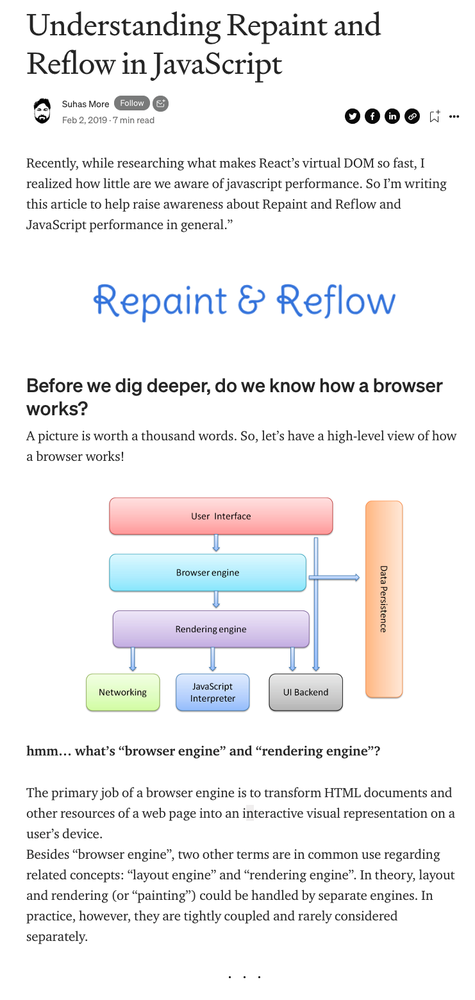
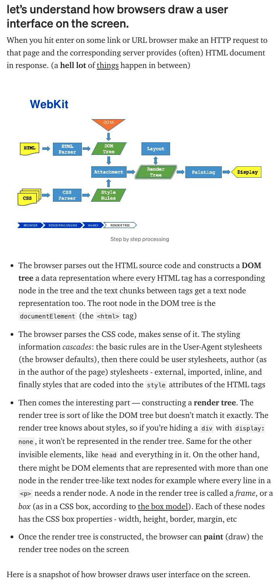
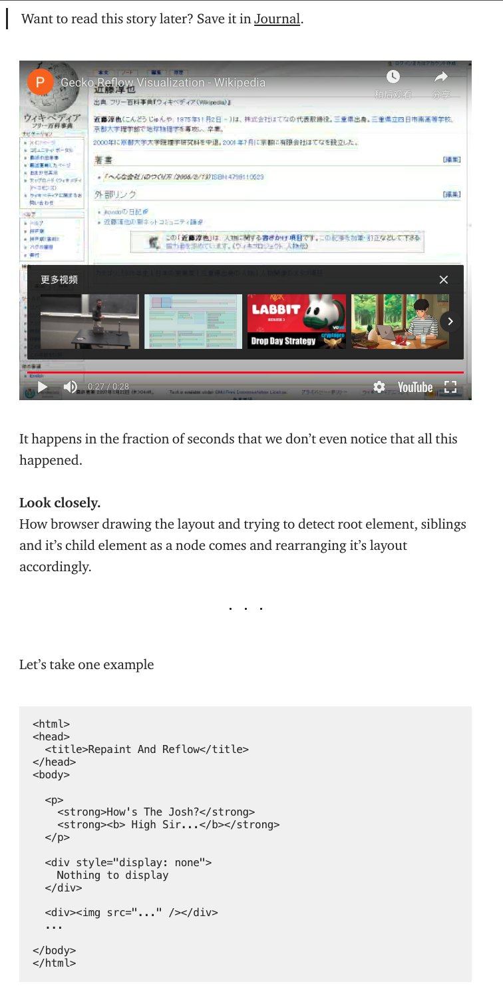
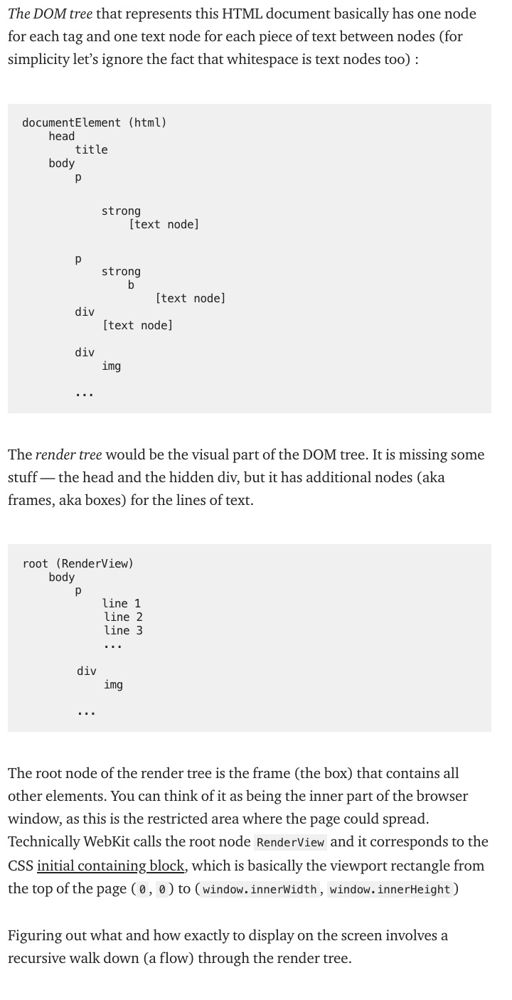
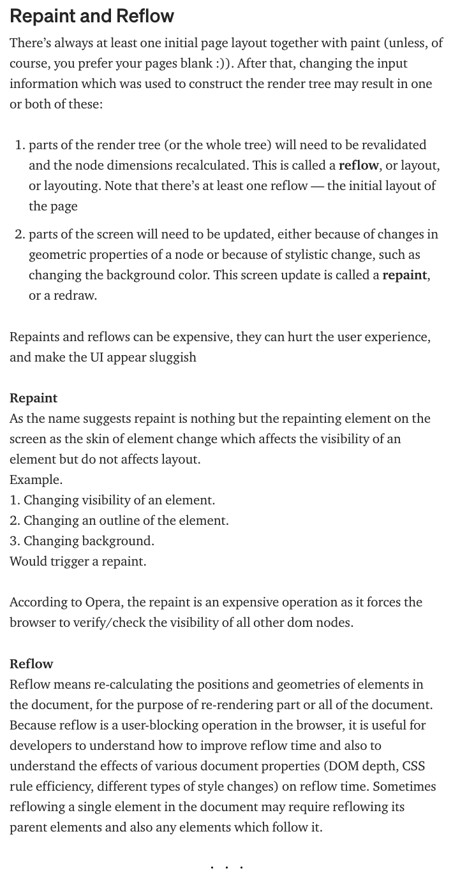
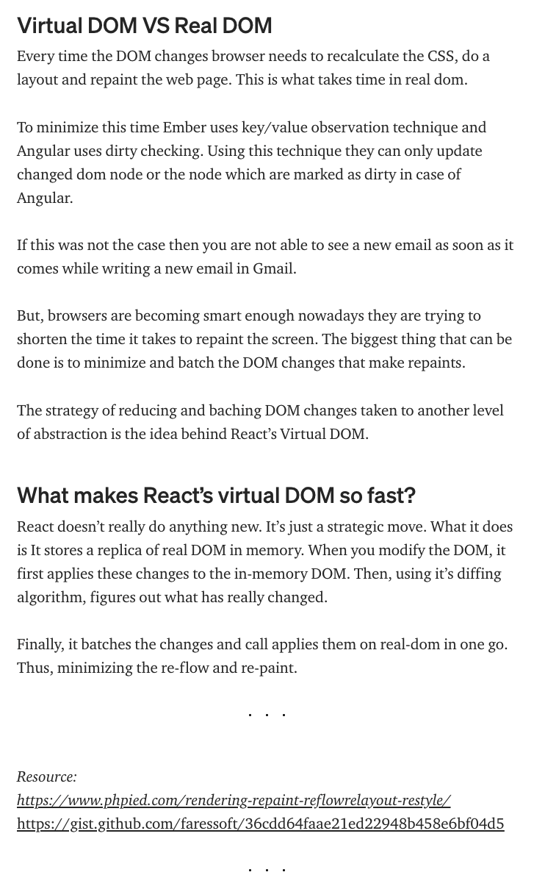

总结: 通过html构建DOM Tree, 再通过CSS 和 DOM Tree构建带有样式的Render Tree. 在Render Tree中, 一些`display:none`, `<head>`等不可见标签都不会出现. 一旦Render Tree完成, 浏览器就会 paint (draw) the render tree nodes on the screen.

Reflow: 意味着重新计算元素的位置等, 影响layout, 会导致render tree变化. parts of the render tree (or the whole tree) will need to be revalidated and the node dimensions recalculated.
Repaint: 重新画, 不会影响layout, no dimensions changed. parts of the screen will need to be updated, either because of changes in geometric properties of a node or because of stylistic change, such as changing the background color. This screen update is called a repaint, or a redraw.

## blog 2

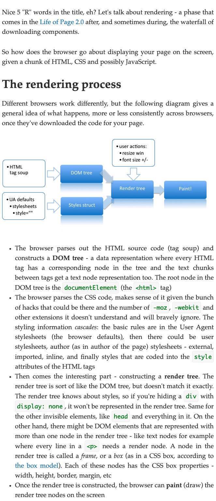
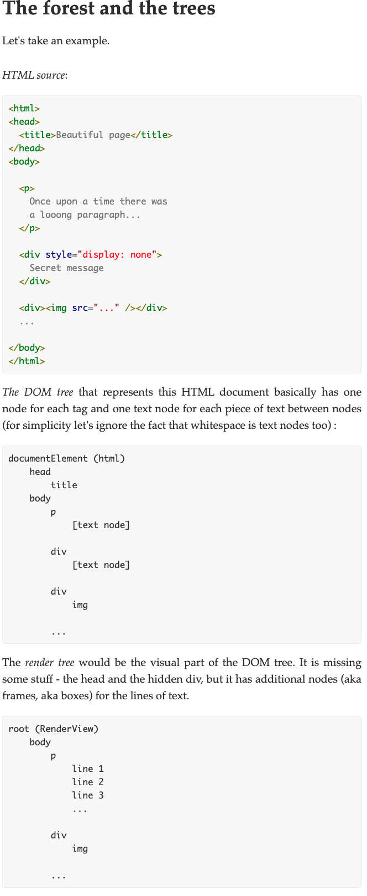
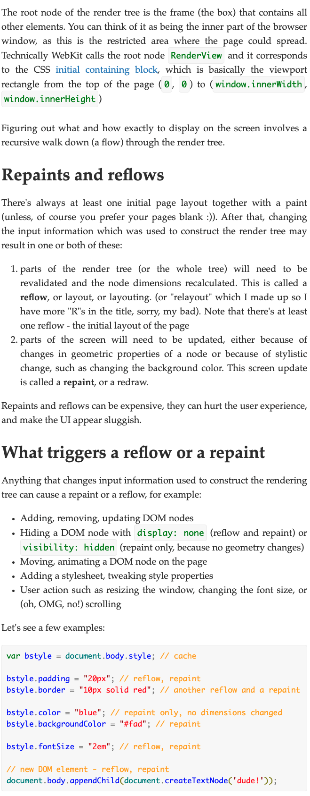
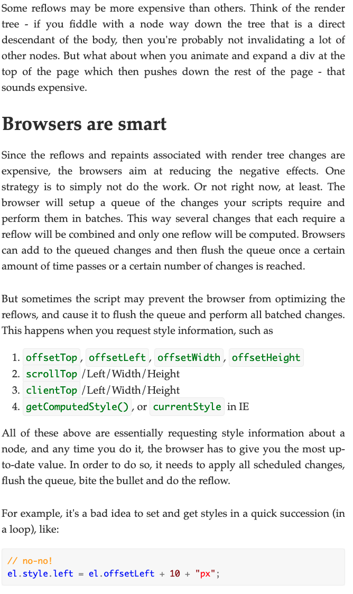
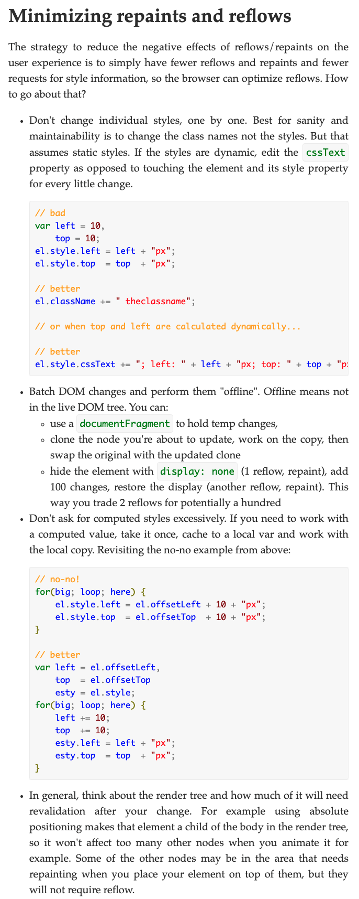
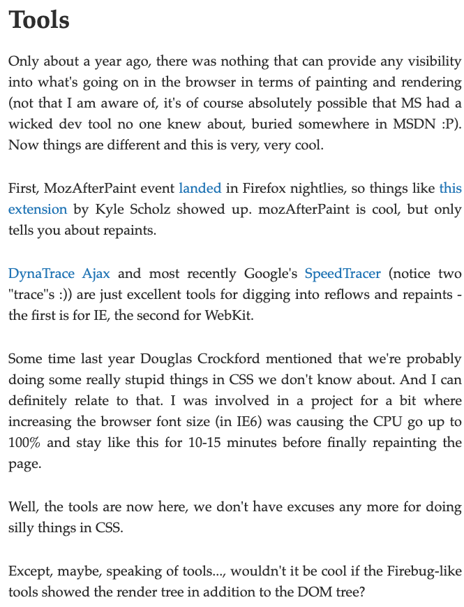
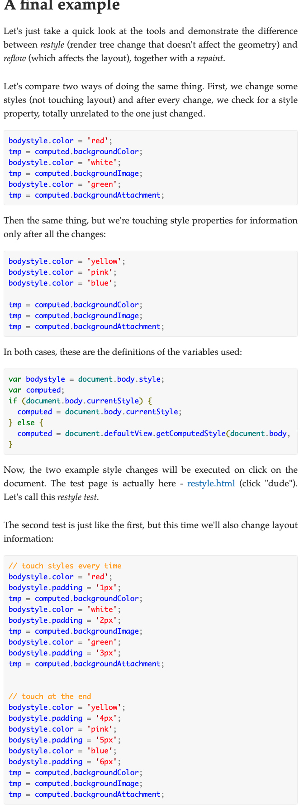
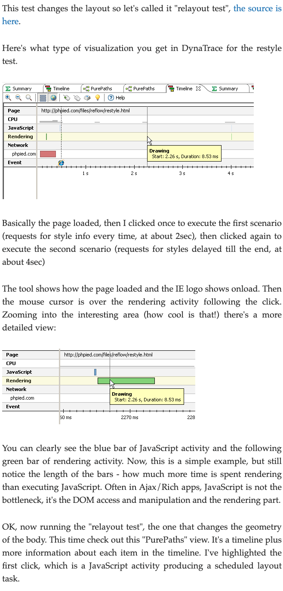
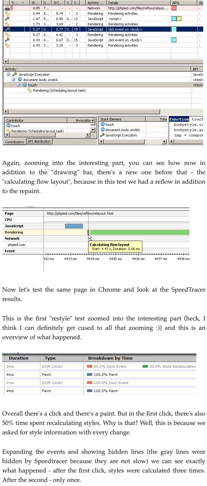
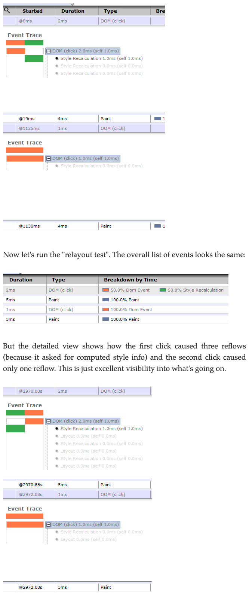
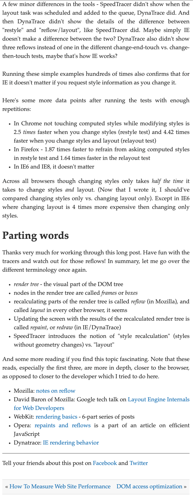

## reference

[blog](https://medium.com/swlh/what-the-heck-is-repaint-and-reflow-in-the-browser-b2d0fb980c08)
[blog2](https://www.phpied.com/rendering-repaint-reflowrelayout-restyle/)