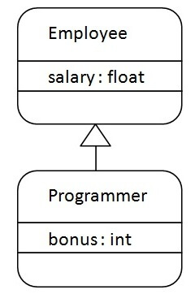

# 装饰器

## 读这一篇就够了

[link](https://juejin.cn/post/6844904100144889864)

## [Java继承](https://www.javatpoint.com/inheritance-in-java)

### 定义

Inheritance in Java is a mechanism in which one object acquires all the properties and behaviors of a parent object. It is an important part of OOPs (Object Oriented programming system).

The idea behind inheritance in Java is that you can create new classes that are built upon existing classes. When you inherit from an existing class, you can reuse methods and fields of the parent class. Moreover, you can add new methods and fields in your current class also.



Programmer is the subclass and Employee is the superclass. The relationship between the two classes is Programmer IS-A Employee. It means that Programmer is a type of Employee.

```java
class Employee{
    float salary=40000;
}

class Programmer extends Employee{
    int bonus=10000;
    public static void main(String args[]){
        Programmer p=new Programmer();
        System.out.println("Programmer salary is:"+p.salary);
        System.out.println("Bonus of Programmer is:"+p.bonus);
    }
}

```

### why use inheritance

* For Method Overriding (so runtime polymorphism can be achieved).
* For Code Reusability.

### type


### override

[link](https://javagoal.com/method-overriding-rules-in-java/)

1.Argument/Parameters list

The argument/parameter list of the overriding method (of child class) must be the same as the Overridden method(the method of parent class).

2.Private/static/final methods can’t override

## 装饰器/依赖注入

### 相比较继承

继承： all subclasses must inherit the same behavior

依赖注入：it is possible to add multiple new responsibilities to objects through this technique, including responsibilities that were not even thought of by the designer of the superclass. 可扩展性较大
By dynamically composing objects, I can add new functionality by writing new code rather than altering existing code. Because I’m not changing existing code, the chances of introducing bug or causing unintended side effects in pre-existing code are much reduced

