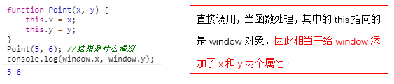
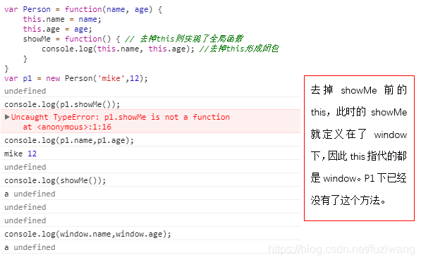
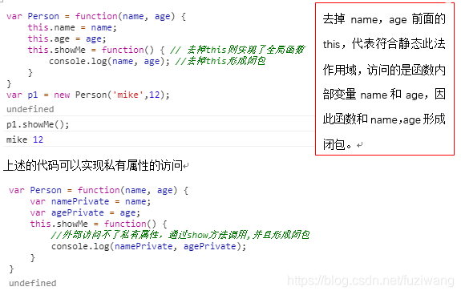

# this

[toc]

## this详解

### 定义

`this`指代一个当前执行的代码的object；换句话说，每一个js函数在执行的时候都会涉及到一个当前的执行context，叫做`this`

### 理解`this`

去理解`this`， 我们只需要知道这个函数将要怎么样(how)、什么时候(when)、来自哪里(from where)被调用，而不用管这个函数在哪里或者怎样被声明(delcare)或者定义(define)。

### 代码层面解析

```javascript
function bike() {
  console.log(this.name);
}

var name = "Ninja";
var obj1 = { name: "Pulsar", bike: bike };
var obj2 = { name: "Gixxer", bike: bike };

bike();           // "Ninja"
obj1.bike();      // "Pulsar"
obj2.bike();      // "Gixxer"
```

在上方的代码场景，`bike()`的工作是打印`this.name`, 这意味着它正在尝试打印当前执行`context`（即这个对象）的 name 属性的值。

1. 上方直接调用`bike()`则会打印出`"Ninja"`。因为没有指定执行的context，所以默认情况下它的全局context中存在一个变量名称，其值为“Ninja”。
2. `obj1.bike()`打印`"Pulsar"`是因为`bike()`函数执行的context是`obj1`，所以`this.name`变成了`obj.name`。
3. `obj2.bike()`和上述一样

## 默认绑定 和 隐式绑定

### 默认绑定default binding

如果我们使用`strict mode`, 则默认的`this`将不再是全局global context, 而是`undefined`。这叫做'default binding'

### 隐式绑定implicit binding

如果有一个object，其property是一个函数则该object就是函数的context。函数的`this`指这个object。这是‘implicit binding'隐式绑定

```javascript
ar obj1 = {
  name: "Pulsar",
  bike: function() {
    console.log(this.name);
  }
}
var obj2 = { name: "Gixxer", bike: obj1.bike };
var name = "Ninja";
var bike = obj1.bike;

bike();           // "Ninja"
obj1.bike();      // "Pulsar"
obj2.bike();      // "Gixxer"
```

上方代码`bike();   // "Ninja"`是默认绑定，`obj1.bike() 和 obj2.bike()`是隐式绑定。 这里`bike`函数是在obj1内声明的，但是正如之前说的那样：不用管这个函数在哪里或者怎样被声明(delcare)或者定义(define)。当我们执行`obj2.bike()`时候，context就是obj2，所以`obj2.name`便被打印了

## 显式绑定 和 硬式绑定

fixed绑定（中文是啥？ 硬式绑定？）

### 显式绑定(explicit binding)：call(), apply()

如果我们用`call(), apply()`，执行的context就变成这些方法的第一个参数：

```javascript
function bike() {
  console.log(this.name);
}

var name = "Ninja";
var obj = { name: "Pulsar" }

bike();           // "Ninja"
bike.call(obj);   // "Pulsar"
```

### 硬式绑定fixed/hard binding

我们可以强制让`this`变得相同，无论来自哪里

```javascript
var bike = function() {
  console.log(this.name);
}
var name = "Ninja";
var obj1 = { name: "Pulsar" };
var obj2 = { name: "Gixxer" };

var originalBikeFun = bike;
bike = function() {
  originalBikeFun.call(obj1);
};

bike();           // "Pulsar"
bike.call(obj2);  // "Pulsar"
```

上述`bike() 和 bike.call(obj2);`都打印`obj1.name`即`"Pulsar"`意味着执行的`bike` function的context一直是`obj1`。

## new 关键字

* JS（ES5） 并没有类（class）的概念，而是使用基于原型（prototype）的继承方式
* JS中的构造函数充当了类的角色，如果不使用 new 调用，则和普通函数一样。
* 如果作为构造函数正确调用时，构造函数中的this 绑定到新创建的对象上

```javascript
function Point(x, y) {
    this.x = x;
    this.y = y;
}
var p = new Point(2, 3);
// 此时构造函数中的this就替换成了p对象
console.log(p);  // Point{x:2,y:3}
```

若直接调用Point函数，会是怎样一种情况，直接调用的话this指的是谁？



补充说明：




## this捆绑的优先级

* 首先检查是否这个函数通过new被调用
* 第二步检查是否这个函数被`call()`或者`apply()`调用（显式绑定）
* 第三步检查是否隐式绑定
* 最后默认为全局`default global object`（严格模式时候为未定义）
